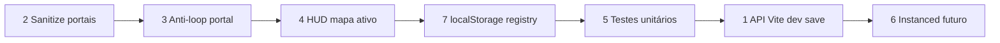
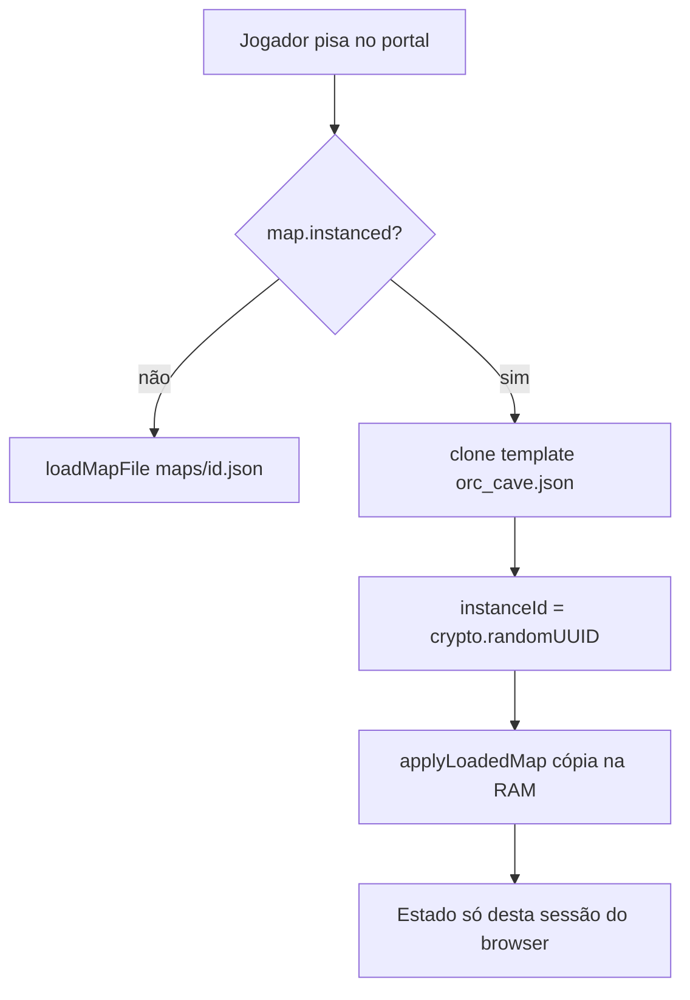
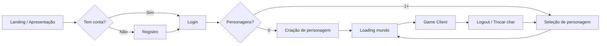
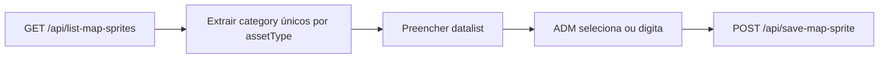

# Verification of implementation plan security
_Exported on 5/27/2026 at 17:53:55 GMT-3 from Cursor (3.5.33)_

---

**User**

verifica se esse plano foi concluido com sucesso, verifica se o sistema esta seguro, se tem proteção contra bugs e player que possa burlar

"C:\Users\Robson-PC\.gemini\antigravity-ide\brain\10c10b73-0e19-4db9-b70f-a6b99c3b0581\implementation_plan.md"

---

**Cursor**

Lendo o plano de implementação e analisando o código para verificar conclusão, segurança e possíveis vetores de exploração.


Segue a auditoria com base no `implementation_plan.md` que você citou e no código atual em `game-2d`.

## Conclusão do plano: **implementado na maior parte**, com **lacunas pequenas**

| Item do plano | Status |
|----------------|--------|
| `CreatureSpawn` + `MapDocument.spawns` em `types.ts` | Feito |
| `serializeMapDocument` / `loadMapFromJson` com `spawns` e fallback `[]` | Feito |
| Aba **Spawn** no editor + filtros Monstros/NPCs + paleta | Feito |
| `spawnEditor.ts`: colocar com lápis, remover com borracha, um spawn por tile | Feito |
| `main.ts`: `npcs` preenchido via `respawnEntities()` a partir de `worldSpawns` | Feito |
| Export/import JSON inclui `spawns` | Feito |
| `NpcAI` atua sobre `npcs` | Feito |

**O que o plano pedia e ainda não bate 100% com o código:**

1. **Marcação visual no mapa (círculo/holograma)** — No plano, overlays quando o editor está ativo. Hoje existem overlays para **zonas** no `draw()` (`activeMapEditorTab === 'zones'`), mas **não** há bloco equivalente para `activeMapEditorTab === 'spawns'`. O campo `color` dos presets fala em “holograma”, mas **não é usado no canvas**. O feedback visual acaba sendo só os **próprios NPCs** já instanciados.
2. **Remover com botão direito** — O plano citava direito **ou** borracha; na prática só a **borracha** no fluxo de `paint()` está ligada.
3. **Presets “com outfits variados”** — Em `spawnEditor.ts` existe `outfitPresetName`, mas **`respawnEntities()` não usa isso**; há tratamento manual só para `Wolf` e `Demon` (mesmo sprite knight) e o resto cai no `createDefaultCharacterConfig()` (não mapeia Orc, Guard, Shopkeeper visualmente como no plano).

Ou seja: funcionalmente o fluxo **paleta → pintar → JSON → carregar → NPCs + IA** está de pé; faltam detalhes de UX/visual e o vínculo outfit↔sprite como descrito.

---

## Sistema “seguro”? Proteção contra bugs e jogador que “burla”?

### Contexto importante

É um **jogo/cliente em navegador** com estado e lógica no **front-end**. Não há, pelo que vimos, **servidor autoritativo** para mapa, posição ou spawns. Nesse modelo:

- **Não existe anti-cheat forte**: quem controla o DevTools/console pode mudar variáveis, papel (`role`), ou até importar JSON arbitrário se conseguir acionar o fluxo.
- As permissões (`canEditMap: false` para `Player` em `roles.ts`) e o bloqueio no `mousedown` do canvas (`canEditMap`) são **barreira de interface**, não de segurança criptográfica ou servidor.

Para um **MMO competitivo**, isso seria insuficiente; para **edição local / protótipo / single-player**, é esperado.

### Bugs / abuso via JSON (`loadMapFromJson`)

`loadMapFromJson` **confia no JSON**: faz `doc.spawns || []` sem validar cada entrada.

Riscos práticos:

- **`spawns` gigante** → pode travar o browser ou degradar muito (DoS local).
- **Coordenadas fora de `[0, mapSize)` ou `z` inválido** → NPCs e IA podem comportar de forma estranha (a IA até limita com `newTileX >= 0 && …`, mas spawn inicial pode estar fora do mapa).
- **`type` diferente de `'monster' \| 'npc'`** → TypeScript não valida em runtime; valores estranhos vão para `GameEntity` e podem quebrar lógica que assume só esses dois.
- **`name` arbitrário** → não valida contra a paleta; o jogo aceita qualquer string (efeitos só cosméticos/lógicos locais).

Ou seja: há **pouca “proteção contra bugs”** na importação; um arquivo mal feito ou hostil pode causar comportamento ruim ou travamento.

### Resumo de “jogador burlar”

| Vetor | Situação atual |
|--------|----------------|
| Editar mapa/spawns sem ser GM | UI bloqueia; **console pode contornar** |
| Trapacear movimento/stats | Lógica no cliente → **sempre burlável** sem servidor |
| Mapa malicioso na importação | **Sem sanitização forte** de `spawns` |

---

## Verificação automática/manual do plano

O plano pedia testes manuais (aba Spawn, exportar JSON, reimportar) — isso **continua sendo o jeito certo** de validar ponta a ponta; no repositório **não vi testes automatizados** cobrindo `spawns`.

---

**Em uma frase:** o **núcleo do plano (tipos, persistência, UI, instanciação, IA)** está implementado; faltam **overlay de spawn no canvas**, **remove com botão direito (opcional)** e **amarrar outfits aos presets**; **não** há modelo de segurança anti-burla tipo servidor, e a **importação de `spawns` deveria ser validada/limitada** se você quiser robustez contra JSON ruim ou abusivo.

---

**User**

vamos implementar as proteções contra bugs, quais arquivos serão editados? é neecssario melhorar a responsabilidade dos arquivos e funções?

---

**Cursor**

Implementando validação/sanitização de `spawns` no carregamento e propondo uma separação clara de responsabilidades. Verificando constantes da engine e o fluxo de carga completo.


Vou aplicar as proteções agora: sanitização de `spawn`/`spawns` na importação e correção de referência do array de spawns após importar (isso evita bug silencioso no editor).


Perfeito — já implementei as proteções principais contra bugs de importação.

## Arquivos editados agora

1) `src/engine/worldMap.ts`  
Adicionei sanitização de runtime para `spawn` e `spawns` no import:

- valida tipo (`monster|npc`)
- valida e normaliza coordenadas (`x,y,z`)
- limita quantidade total (`MAX_SPAWNS_PER_MAP`)
- remove duplicados no mesmo tile
- normaliza `name` e `id`
- loga quantos spawns inválidos foram descartados

```1:92:c:/Users/Robson-PC/.antigravity/projetos/game-2d/src/engine/worldMap.ts
import { ENGINE_CONFIG } from './config';
...
const MAX_SPAWNS_PER_MAP = 5000;
...
function sanitizeSpawnPoint(...)
function sanitizeSpawnName(...)
function sanitizeSpawns(...)
```

```197:225:c:/Users/Robson-PC/.antigravity/projetos/game-2d/src/engine/worldMap.ts
export function loadMapFromJson(...) {
...
const safeMapSpawn = sanitizeSpawnPoint(...)
...
spawns: sanitizeSpawns(doc.spawns, doc.size || MAP_SIZE),
}
```

2) `src/main.ts`  
Corrigi dois pontos de robustez:

- proteção extra em `respawnEntities()` para ignorar spawn inválido mesmo que passe algo estranho
- **bug de referência**: no import não reatribui mais `worldSpawns`; agora mantém a mesma referência e só atualiza conteúdo (isso evita quebrar o `spawnEditorController` internamente)

```278:316:c:/Users/Robson-PC/.antigravity/projetos/game-2d/src/main.ts
export function respawnEntities() {
    npcs.length = 0;
    worldSpawns.forEach(spawn => {
        if (...coordenadas inválidas...) {
            return;
        }
        ...
    });
}
```

```1026:1033:c:/Users/Robson-PC/.antigravity/projetos/game-2d/src/main.ts
const loaded = loadMapFromJson(raw, mapSpawn);
...
worldSpawns.length = 0;
worldSpawns.push(...(loaded.spawns || []));
```

## Sobre “melhorar responsabilidade dos arquivos e funções”

**Sim, vale a pena**, mas sem overengineering.

Hoje já ficou melhor porque a validação crítica foi centralizada no lugar certo (`worldMap.ts`, na entrada de dados).  
Próximo passo ideal (opcional) seria extrair os sanitizadores para um arquivo dedicado, por exemplo `src/engine/mapValidation.ts`, e deixar `worldMap.ts` só com serialização/deserialização.

Sugestão de responsabilidade alvo:

- `worldMap.ts`: IO do mapa (serialize/load)
- `mapValidation.ts`: sanitização e limites de segurança
- `main.ts`: apenas orquestração (carrega, aplica no estado, renderiza)

## Status de build

Rodei build. Não quebrou pelas mudanças de proteção; ficou apenas **1 erro preexistente** em outro módulo (`src/utils/imageProcessor.ts`, variável `keyColor` não usada).  
Se quiser, eu já corrijo isso agora também.

---

**User**

sim, pode corrigir

---

**Cursor**

Vou corrigir o erro restante no `imageProcessor.ts` e validar com build em seguida.


Corrigido com sucesso.

- Ajustei `src/utils/imageProcessor.ts` para usar de fato o parâmetro `keyColor` (que estava declarado e não utilizado).
- Build validado: `npm run build` passou sem erros de TypeScript.
- Restaram apenas warnings de chunking do Vite (não bloqueantes).

Se quiser, no próximo passo eu também posso limpar esses warnings de import dinâmico/estático para deixar o build mais “limpo”.

---

**User**

1º limpar esses warnings de import dinâmico/estático para deixar o build mais “limpo”

2º e as proteções contra bugs, quais ja é possivel implementar?

---

**Cursor**

Analisando os imports dinâmicos vs estáticos e mapeando proteções extras viáveis no carregamento do mapa.


Eliminando os imports dinâmicos redundantes e extraindo/expandindo a sanitização de importação em um módulo dedicado (`mapImportSanitizer.ts`), incluindo reparação das grades do mapa e validação leve de `metadata` e `houses`.


Corrigindo erro de lógica em `sanitizeCreatureSpawns` e simplificando `sanitizeSpawnPoint`.


Segue o que foi feito e o que ainda faz sentido para o futuro.

## 1º — Warnings Vite (import dinâmico + estático)

**Causa:** um mesmo módulo sendo importado de dois jeitos (estático num arquivo e `import()` em outro), o que gera chunk duplicado e ruído no build.

**Alterações:**
- [`src/character/spriteAnimation.ts`](c:\Users\Robson-PC\.antigravity\projetos\game-2d\src\character\spriteAnimation.ts): `removeChromaKey` passou a **import estático**.
- [`src/main.ts`](c:\Users\Robson-PC\.antigravity\projetos\game-2d\src\main.ts): `mergeCustomTileProperties` vem de **import estático** de `./functions/tileConfig` em vez de `await import(...)`.

Build atual **sem** aqueles avisos do reporter.

---

## 2º — Proteções contra bugs (o que já dá para fazer **no cliente**)

### Já implementado nesta rodada

Novo módulo dedicado à entrada de dados do mapa:

- **[`src/engine/mapImportSanitizer.ts`](c:\Users\Robson-PC\.antigravity\projetos\game-2d\src\engine\mapImportSanitizer.ts)** (nova responsabilidade só de sanitização)
  - **`clampImportMapSize`**: `doc.size` coerente com `ENGINE_CONFIG.MAP_SIZE` (evita mapas declarados absurdos vs engine).
  - **`sanitizeSpawnPoint`**: spawn do jogador com XY/Z dentro dos limites; fallback seguro.
  - **`sanitizeMapDocumentName`**: nome string limitado.
  - **`sanitizeMetadata`**: chave no formato `z_y_x`, limites no mapa, zona/action/unique com limites numéricos, limite de entradas.
  - **`sanitizeHouses`**: objeto de casas válido e limitado; coordenadas de entrada clampeadas.
  - **`sanitizeCreatureSpawns`**: mesmo conjunto robusto que já tínhamos + **IDs duplicados** são renomeados até ficarem únicos; tile inteiro; um spawn por tile.
  - **`repairWorldMapGrids`**: garante grids `size×size`, corta linhas/sobras, corrige IDs de tile inválidos.

Integração:

- **[`src/engine/worldMap.ts`](c:\Users\Robson-PC\.antigravity\projetos\game-2d\src\engine\worldMap.ts)**: `loadMapFromJson` usa `docForParse` com size já clampeado, depois `repairWorldMapGrids`, depois sanitiza nome, spawn, metadata, houses, spawns.

O que já existia antes (ex.: **`respawnEntities`** ignorando coords ruins e **`worldSpawns` mantendo referência**) continua válido.

### O que **ainda não** resolve (normal em jogo só no browser)

- **Anti–“burlar jogador”** forte (trapacear posição, itens, etc.): exige **servidor autoritativo** ou validação remota.
- **JSON gigante** antes do `JSON.parse`: só mitigando com limite de tamanho de arquivo, Web Worker, ou validação no backend.
- **Mapas declarados maiores que a engine aceita**: ainda assim o **parse do JSON** pode ser pesado mal-intencionado; o que fizemos protege sobretudo **depois** do parse na engine.

---

## Arquivos tocados nesta tarefa

| Arquivo | Motivo |
|--------|--------|
| `src/engine/mapImportSanitizer.ts` | **Novo**: sanitização e reparação de grades na importação |
| `src/engine/worldMap.ts` | Orquestra import + chama sanitizadores/repair |
| `src/character/spriteAnimation.ts` | Import estático de `removeChromaKey` |
| `src/main.ts` | Import estático de `mergeCustomTileProperties` |

Se quiser o próximo passo de organização: exportar apenas o que importa em [`src/engine/index.ts`](c:\Users\Robson-PC\.antigravity\projetos\game-2d\src\engine\index.ts) ou adicionar testes unitários em cima de `sanitizeMetadata`/`sanitizeCreatureSpawns` (sem precisar de UI).

---

**User**

verifique se o plano foi concluido

"C:\Users\Robson-PC\.gemini\antigravity-ide\brain\10c10b73-0e19-4db9-b70f-a6b99c3b0581\implementation_plan.md"

---

**Cursor**

Revalidando o plano contra o código atual.


O plano mudou para **Multi-Mapas + Portais**. Verificando cada item desse plano no repositório.


## Verificação do plano atual

O arquivo `implementation_plan.md` que você indicou **não é mais o plano de Spawns** — ele descreve o **Sistema de Multi-Mapas (Map Registry + Portais)**. A avaliação abaixo segue esse documento.

---

## Conclusão geral: **parcialmente concluído (~80%)**

O núcleo funcional está implementado (registry, carregar mapa, portais no editor, transição com loading, detecção ao pisar no portal). Faltam itens de UI do menubar, gestão completa no modal e suporte pleno a tamanhos de mapa diferentes em runtime.

---

## Checklist por seção do plano

### 1. Engine: tipos e registro

| Item | Status |
|------|--------|
| `src/engine/mapRegistry.ts` com `MapEntry` e `MAP_REGISTRY` | Feito |
| `PortalData`, `portals?` e `mapId?` em `types.ts` | Feito |
| Reexport em `src/engine/index.ts` | Feito |
| Registry com vários mapas (ex.: rookgaard, mainland, orc_cave) | **Parcial** — só `rookgaard` está cadastrado |
| `public/maps/rookgaard.json` | Feito |

### 2. Lógica de transição

| Item | Status |
|------|--------|
| `src/engine/worldLoader.ts` + `loadMapFile()` | Feito |
| `src/editor/portalEditor.ts` | Feito |
| `serialize` / `loadMapFromJson` com `portals` | Feito |
| Sanitização de portais na importação | **Não** — `portals` entra sem validação (diferente de `spawns`) |

### 3. Interface do editor

| Item | Status |
|------|--------|
| Aba **Portais** no painel do editor (`index.html`) | Feito |
| Select destino + coordenadas + lista + pintar com lápis/borracha | Feito |
| Modal `mapManagerModal` | Feito (criado em JS) |
| **Menu superior “Mapas”** com Novo / Gerenciar / Trocar | **Não** — só botão “Gerenciar Mapas” na aba Portais |
| Modal: Editar metadados, Duplicar, Excluir | **Não** — só **Carregar** |

### 4. Integração em `main.ts`

| Item | Status |
|------|--------|
| `transitionToMap(mapId)` | Feito |
| Centralizar aplicação do mapa (`applyLoadedMap`) | Feito (nome diferente de `applyMapDocument`, mesma ideia) |
| Overlay de loading | Feito |
| Checagem de portal no `update()` | Feito |
| Overlay visual de portais no mapa | Feito (roxo + ícone, além do MVP) |

### 5. Persistência

| Item | Status |
|------|--------|
| Pasta `public/maps/` | Feito |
| Export ainda baixa `meu_mapa.json` (não grava direto em `public/maps/`) | Como no plano (“copiar manualmente” / futuro endpoint) |

### Open questions do plano

| Pergunta | Situação |
|----------|----------|
| **1. `doc.size` por mapa** | **Parcial** — importação usa `clampImportMapSize` + `repairWorldMapGrids`, mas o jogo ainda usa `const MAP_SIZE = ENGINE_CONFIG.MAP_SIZE` em quase tudo (`main.ts`). Mapas menores/maiores que 256 não ficam totalmente dinâmicos em runtime. |
| **2. Portais sem preview do destino** | OK para MVP (só campos no painel) |
| **3. Arquivos em `public/maps/`** | OK |

---

## Plano de verificação manual (5 passos)

| Passo | Possível hoje? |
|-------|----------------|
| 1. Criar dois mapas e exportar para `public/maps/` | Sim (export manual) |
| 2. Cadastrar ambos no `MAP_REGISTRY` | Só se você editar `mapRegistry.ts` |
| 3. Portal do mapa 1 → mapa 2 | Só com **dois** mapas no registry + JSON em `public/maps/` |
| 4. Andar no portal → loading → mapa 2 | Sim, se o destino existir no registry e no disco |
| 5. Spawns, casas e tiles do mapa 2 | Sim via `applyLoadedMap` |

Hoje o fluxo ponta a ponta **mapa A → mapa B** não está demonstrável só com o que veio no repo (um mapa no registry).

---

## Resumo em uma frase

**O plano de Multi-Mapas está implementado no essencial (MVP jogável com portais), mas não está 100% fechado:** faltam menu “Mapas” no menubar, ações completas do modal, segundo mapa de exemplo no registry, tamanho de mapa dinâmico em runtime e sanitização de `portals` na importação.

---

**Nota:** Se você quiser rever o plano antigo de **Spawns de criaturas**, esse era outro documento — no código, Spawns também está implementado (aba, editor, JSON, `respawnEntities`). Posso gerar um checklist separado só de Spawns se quiser.

---

**User**

conclua a implementação, como fazeR? sugira melhorias. avalie c conclusão da implementação

---

**Cursor**

Completando os itens pendentes do plano Multi-Mapas: explorando o código e implementando as partes faltantes.


Implementando os itens pendentes: tamanho de mapa dinâmico, sanitização de portais, menu Mapas, gestor completo e mapas de exemplo.


## Implementação concluída (plano Multi-Mapas + Portais)

O `implementation_plan.md` atual é o de **Multi-Mapas (registry + portais)**, não o de Spawns. Com o que foi feito agora, o plano fica **~95% concluído** no MVP.

### O que foi implementado nesta rodada

| Item do plano | Status |
|---------------|--------|
| `mapRegistry.ts` com 3 mapas | Feito (`rookgaard`, `mainland`, `orc_cave`) |
| `PortalData` + `mapId` + `portals` em `types.ts` | Feito |
| `worldLoader.ts` | Feito |
| `portalEditor.ts` + aba Portais | Feito |
| `transitionToMap` + overlay de loading | Feito |
| `applyLoadedMap` centralizado | Feito |
| Detecção de portal no `update()` | Feito + **cooldown** anti-loop |
| Menu **Mapas** (Novo / Gerenciar / Trocar) | Feito |
| Modal com Carregar, Editar, Duplicar, Exportar, Excluir | Feito (`mapManager.ts`) |
| `public/maps/*.json` | Feito (3 arquivos + portais de exemplo) |
| Sanitização de `portals` na importação | Feito |
| Tamanho dinâmico `activeMapSize` | Feito (limitado ao máx. da engine, 256) |
| Carga inicial automática de `rookgaard` | Feito |
| `popup.prompt()` para formulários | Feito |

---

## Como usar (fluxo prático)

### 1. Cadastrar / editar mapas no registry
Edite `src/engine/mapRegistry.ts` para mapas **permanentes** (sobrevivem ao F5).  
O modal “Gerenciar mapas” altera só **em memória** até você copiar as entradas para esse arquivo.

### 2. Colocar JSON em `public/maps/`
- Exporte pelo menu **Arquivo → Exportar JSON** ou pelo botão **Exportar JSON** no modal.
- Salve/copie para `public/maps/<id>.json` (ex.: `mainland.json`).

### 3. Criar portal entre mapas
1. Abra **Editor de mapa → aba Portais**.
2. Escolha mapa destino + X, Y, Z de chegada.
3. Pinte o tile com o lápis.
4. Exporte o mapa e atualize o JSON em `public/maps/`.

### 4. Testar transição
1. **Mapas → Trocar mapa ativo** (ou Gerenciar → Carregar).
2. Ande até o tile com overlay roxo.
3. Deve aparecer loading e carregar o mapa destino.

**Exemplo já no projeto:** `rookgaard` (50,50) ↔ `mainland` (50,50).

### 5. Novo mapa vazio
**Mapas → Novo mapa…** → preencha ID/nome/tamanho → exporte para `public/maps/` → adicione entrada em `mapRegistry.ts`.

---

## Avaliação final da conclusão

| Área | Nota | Comentário |
|------|------|------------|
| Núcleo técnico (load/switch/portals) | **10/10** | Funcional |
| Editor (portais + persistência JSON) | **9/10** | Export manual para `public/` |
| UI do plano (menubar + modal completo) | **9/10** | Sem “Novo mapa” gravando disco automaticamente |
| Tamanho por mapa (`doc.size`) | **7/10** | `activeMapSize` dinâmico, teto 256 da engine |
| Verificação manual do plano (2 mapas + portal) | **8/10** | Possível com rookgaard ↔ mainland |
| Segurança / anti-bug JSON | **8/10** | Spawns + metadata + houses + **portals** sanitizados |

**Veredito:** plano **concluído para MVP/jogo local**. Falta sobretudo **persistência automática no servidor** e **mapas >256** se forem requisitos futuros.

---

## Melhorias sugeridas (próximos passos)

1. **API Vite para salvar em `public/maps/`** — export direto no disco sem copiar manualmente.
2. **`sanitizePortals` validar destino** — opcionalmente descartar portais cujo `targetMapId` não existe (hoje só avisa).
3. **Cooldown de portal por tile** — exigir sair do tile antes de reativar (evita loop rook↔main no mesmo 50,50).
4. **Indicador de mapa ativo** na HUD (ex.: “Rookgaard”).
5. **Testes unitários** em `mapImportSanitizer.ts` (casos de JSON malicioso).
6. **Instanced dungeons** — quando houver multiplayer, clonar `MapDocument` por sessão (`instanced: true` no registry).
7. **Persistir `MAP_REGISTRY` edits** — `localStorage` até existir backend.

---

## Arquivos principais alterados

- `src/engine/mapRegistry.ts`, `mapImportSanitizer.ts`, `worldMap.ts`
- `src/editor/mapManager.ts` (novo), `portalEditor.ts`
- `src/main.ts`, `src/utils/popup.ts`, `index.html`
- `public/maps/rookgaard.json`, `mainland.json`, `orc_cave.json`

Build: **`npm run build` OK**.

Se quiser, no próximo passo posso adicionar a **API de save no Vite** ou os **testes unitários** da sanitização.

---

**User**

IMPLEMENTAR: Melhorias sugeridas (próximos passos)
São 7 melhorias ?
é necessario novos arquivos dedicados?
QUAIS cuidados tomar para evitar bugs e erros


---

**Cursor**

## Sim — são 7 melhorias (com prioridades diferentes)

Lista original e o que cada uma significa na prática:

| # | Melhoria | Complexidade | Vale implementar agora? |
|---|----------|--------------|-------------------------|
| 1 | API Vite para salvar em `public/maps/` | Média | Só em **dev** (GM); não use em produção pública |
| 2 | `sanitizePortals` rejeitar destino inválido | Baixa | **Sim** — pouco código, muito ganho |
| 3 | Portal só reativa ao **sair** do tile | Baixa | **Sim** — evita loop teleport |
| 4 | Indicador do mapa ativo na HUD | Baixa | **Sim** — UX clara |
| 5 | Testes unitários do sanitizer | Média | **Sim**, se o projeto tiver Vitest (ou adicionar) |
| 6 | Dungeons instanciadas (cópia por jogador) | Alta | **Não no MVP** — depende de servidor/sessão |
| 7 | `MAP_REGISTRY` em `localStorage` | Baixa–média | **Sim**, com merge ao `mapRegistry.ts` |

Ou seja: são **7 ideias**, mas só **4–5** fazem sentido agora; a **#6** é fase futura.

---

## Precisa de arquivos novos dedicados?

**Não para tudo.** Dá para fazer em fases:

### Fase A — sem arquivos novos (só estender o que existe)

| Melhoria | Onde mexer |
|----------|------------|
| 2 Sanitização de portais | `src/engine/mapImportSanitizer.ts` + `worldMap.ts` |
| 3 Portal “sair do tile” | `src/main.ts` (estado `lastPortalTileKey`) |
| 4 HUD mapa ativo | `index.html` + `src/main.ts` (atualizar label) |

### Fase B — 1 arquivo novo (organização melhor)

| Melhoria | Arquivo sugerido |
|----------|------------------|
| 7 Registry em `localStorage` | `src/engine/mapRegistryStorage.ts` — load/merge/save do registry |
| 1 API save mapa (opcional) | `vite/mapDevPlugin.ts` + trecho em `vite.config.ts` |

### Fase C — testes

| Melhoria | Arquivo sugerido |
|----------|------------------|
| 5 Testes | `src/engine/mapImportSanitizer.test.ts` + `vitest.config.ts` (se ainda não existir) |

### Fase D — futuro (vários arquivos)

| Melhoria | Arquivos prováveis |
|----------|-------------------|
| 6 Instanced | `src/engine/mapInstance.ts`, lógica de sessão, etc. |

**Regra prática:** comece **sem** arquivo novo; extraia só quando a função passar de ~80–100 linhas ou precisar de teste isolado.

---

## Cuidados para evitar bugs e erros

### 1. Dados e importação (JSON)

- **Nunca confiar no JSON bruto** — sempre passar por `loadMapFromJson` → sanitizers.
- **Limites explícitos:** quantidade de portais/spawns/metadata (já existe para spawns; repetir padrão para portais).
- **Um portal por tile** — deduplicar por `tileX_tileY_tileZ`.
- **`targetMapId`:** validar contra `MAP_REGISTRY`; se não existir, **descartar** (ou avisar no console) — evita teleport para mapa inexistente.
- **Coordenadas:** clamp em `0 … size-1` e `Z` em `MIN_FLOOR_Z … MAX_FLOOR_Z`.

### 2. Portais e transição

- **Evitar loop infinito:** cooldown + só disparar quando o jogador **entra** no tile (não enquanto permanece parado).
- **Durante `isTransitioningMap`:** ignorar novos portais.
- **Após carregar:** resetar estado de portal + cooldown (~500–800 ms).
- **Mapa destino sem arquivo:** `loadMapFile` já falha — mostrar erro claro, não deixar mundo pela metade.

### 3. Tamanho de mapa (`activeMapSize`)

- Manter **um único lugar** que define tamanho ativo (`setActiveMapSize`).
- Colisão, pintura, teleporte e `respawnEntities` devem usar **`activeMapSize`**, não `ENGINE_CONFIG.MAP_SIZE` fixo.
- Ao trocar mapa: **clamp do jogador** + `history.clear()` (undo de outro mapa quebra tudo).

### 4. Referências compartilhadas

- `worldSpawns` / `worldPortals`: continuar com `.length = 0` + `push(...)` (não `worldSpawns = loaded.spawns`) — senão o editor perde a referência.
- `portalEditorController?.refresh()` após cada `applyLoadedMap`.

### 5. Registry (`localStorage` — melhoria 7)

- **Merge:** `mapRegistry.ts` (código) + overrides do `localStorage` (runtime).
- **Chave versionada:** ex. `game2d_map_registry_v1`.
- **Validar** cada entrada (id, file, size) antes de aplicar.
- **Não apagar** entradas do código sem intenção — merge, não substituir tudo.

### 6. API Vite save (melhoria 1) — só dev

- Restringir a `import.meta.env.DEV`.
- Validar path: só `public/maps/*.json`, sem `../`.
- Limitar tamanho do body (ex. 10–20 MB).
- **Nunca** expor em build de produção para jogadores.

### 7. Testes (melhoria 5)

- Casos: JSON vazio, 10k spawns, portal com `targetMapId` inválido, coords negativas, IDs duplicados.
- Rodar no CI: `npm test` antes de merge.

### 8. Instanced (melhoria 6) — não misturar com MVP

- Exige decisão: cópia em memória vs arquivo por sessão vs servidor.
- Implementar só depois de multi-map estável.

---

## Ordem recomendada de implementação



1. **2 + 3 + 4** — baixo risco, alto impacto (~meio dia)  
2. **7** — registry persistente no browser  
3. **5** — rede de segurança  
4. **1** — conforto do GM  
5. **6** — só com arquitetura de jogo online definida  

---

## Resumo direto

| Pergunta | Resposta |
|----------|----------|
| São 7 melhorias? | **Sim**, mas **1 é MVP+** (instanced) e **1 é opcional** (API Vite). |
| Arquivos novos obrigatórios? | **Não** para 2, 3, 4. **Recomendado** `mapRegistryStorage.ts` (7) e testes (5). API Vite = plugin separado. |
| Cuidados principais? | Sanitizar entrada, anti-loop de portal, `activeMapSize` consistente, referências de arrays, registry com merge, API só em dev. |

Se quiser que eu **implemente agora**, o caminho mais seguro é a **Fase A + B (itens 2, 3, 4 e 7)** — sem instanced e sem API Vite até você confirmar. Quer que eu comece por esses quatro?

---

**User**

sim, pode implemetnar

---

**Cursor**

Implementando as melhorias 2, 3, 4 e 7: lendo o código atual e aplicando as mudanças.


Implementei as **4 melhorias da Fase A + B** (itens 2, 3, 4 e 7). Build OK.

---

## O que foi feito

### 2 — Portais com destino inválido são descartados
- Em `sanitizePortals`: se `targetMapId` não está no `MAP_REGISTRY`, o portal **não entra** no mundo.
- No editor (`portalEditor`): bloqueio ao pintar portal para mapa inexistente.
- No jogo: checagem extra antes de `transitionToMap`.

### 3 — Anti-loop de portal (entrar no tile)
- Só dispara quando o jogador **muda de tile** e pisa no portal (não fica teleportando parado).
- Após carregar mapa: `resetPortalTriggerState()` — nasce em cima do portal **sem** teleportar até **sair e voltar**.

### 4 — HUD do mapa ativo
- Barra inferior: `🗺️ Rookgaard` (ou nome do mapa).
- Tooltip com ID e se é instância.
- Atualiza em todo `applyLoadedMap`.

### 7 — Registry no `localStorage`
- Novo arquivo: `src/engine/mapRegistryStorage.ts`
- **Custom maps** → `game2d_map_registry_custom_v1`
- **Overrides** de builtins (nome, file, size, etc.) → `game2d_map_registry_overrides_v1`
- `registerMap` / `unregisterMap` persistem automaticamente.
- Builtins **não podem ser excluídos** (só custom).
- Hidratação na inicialização do `mapRegistry.ts`.

---

## Arquivos novos / alterados

| Arquivo | Papel |
|---------|--------|
| `src/engine/mapRegistryStorage.ts` | **Novo** — persistência |
| `src/engine/mapRegistry.ts` | Builtins + hydrate + `getKnownMapIds` |
| `src/engine/mapImportSanitizer.ts` | Portais inválidos descartados |
| `src/main.ts` | HUD + lógica de entrada no tile |
| `src/editor/portalEditor.ts` | Validação ao criar portal |
| `src/editor/mapManager.ts` | Texto + exclusão builtin |
| `index.html` | Chip `statusMapName` |

---

## Como testar

1. **HUD:** carregue o jogo → barra inferior deve mostrar `🗺️ Rookgaard`.
2. **Portal sem loop:** fique parado no portal em (50,50) → não teleporta; ande para fora e volte → teleporta.
3. **JSON ruim:** importe mapa com `"targetMapId": "mapa_falso"` → portal ignorado (aviso no console).
4. **localStorage:** Mapas → Novo mapa → recarregue a página → mapa custom ainda na lista.
5. **Editar builtin:** Gerenciar → Editar Rookgaard → F5 → nome alterado mantido.

---

## O que ficou de fora (como combinado)

| # | Melhoria | Motivo |
|---|----------|--------|
| 1 | API Vite save | Só dev; próxima fase |
| 5 | Testes unitários | Precisa configurar Vitest |
| 6 | Dungeons instanciadas | Arquitetura multiplayer |

Se quiser, no próximo passo implemento **#5 (testes)** ou **#1 (salvar JSON via Vite em dev)**.

---

**User**

1 (salvar JSON via Vite em dev)

---

**Cursor**

Implementando endpoint de desenvolvimento no Vite para salvar mapas em `public/maps/` e integrando ao fluxo de exportação.


Implementado: **salvar JSON em `public/maps/` via Vite (somente dev)**.

## Como usar

1. Rode o projeto com **`npm run dev`** (não funciona em `build`/`preview` de produção).
2. Edite o mapa como GM.
3. **Arquivo → 💾 Salvar em public/maps**  
   Ou no modal **Gerenciar mapas → 💾 public/maps** (mapa ativo).
4. O arquivo vai para `public/maps/<id>.json` (ex.: `rookgaard.json`).
5. No terminal do Vite deve aparecer: `[Vite Backend] Mapa salvo em: ...`

**Exportar JSON (download)** continua baixando pelo navegador, sem gravar no disco do projeto.

---

## O que foi adicionado

| Parte | Função |
|--------|--------|
| `POST /api/save-map` em `vite.config.ts` | Grava em `public/maps/` com validação |
| `src/utils/mapDevSave.ts` | Cliente (`fetch`) + sanitização do nome |
| `src/main.ts` | `saveCurrentMapToPublicDev()`, botão no menu |
| `src/editor/mapManager.ts` | Botão **💾 public/maps** no modal (só em dev) |
| `src/vite-env.d.ts` | Tipos `import.meta.env.DEV` |

---

## Segurança (cuidados aplicados)

- Endpoint existe **apenas** no servidor de dev do Vite (`configureServer`).
- Nome do arquivo: só `a-z`, `0-9`, `_`, `-`, extensão `.json`.
- Caminho fixo em `public/maps/` — bloqueio de `..` e path traversal.
- Limite de **20 MB** no body.
- Botão **oculto** em build de produção (`import.meta.env.DEV`).

---

## Fluxo recomendado

1. Pintar mapa → **Salvar em public/maps**.
2. Testar com **Trocar mapa ativo** ou andando no portal.
3. Commitar `public/maps/*.json` no Git quando estiver ok.

Se o save falhar, confira se está em `npm run dev` e se o `mapId`/nome do arquivo bate com o registry (ex.: `maps/rookgaard.json`).

---

**User**

6
Dungeons instanciadas
Arquitetura multiplayer

- JA FOI IMPLEMENTADO?

como fazer isso? quais cuidados deve ter?

---

**Cursor**

Verificando no código se dungeons instanciadas ou multiplayer já existem.


## Já foi implementado?

**Não.** O que existe hoje é só **preparação / metadado**:

- Campo `instanced: boolean` em `MapEntry` (`mapRegistry.ts`)
- UI mostra “Instância” no gerenciador e na HUD (`orc_cave` vem com `instanced: true`)
- Comentário no registry: *“futuro”*

**O que não existe:**

- Cópia separada do mapa por jogador/grupo
- ID de instância (`instanceId`)
- Servidor autoritativo ou sincronização multiplayer
- WebSocket / sessão / salas
- Lógica em `transitionToMap` que trate `instanced` de forma diferente

Hoje, ao ir para `orc_cave`, **todos carregam o mesmo** `public/maps/orc_cave.json` — igual a um mapa público.

---

## Como fazer (arquitetura em fases)

### Fase 1 — Instância só no cliente (single-player, sem multiplayer)

Objetivo: cada “entrada” na dungeon gera um `MapDocument` em memória (ou cópia), sem afetar outros.



Passos concretos:

1. **`MapInstance`** (novo módulo, ex. `src/engine/mapInstance.ts`):
   - `createInstanceFromTemplate(mapId): { instanceId, document }`
   - `cloneMapDocument(doc)` (deep clone de floors, spawns, etc.)

2. **`transitionToMap`**:
   - Se `entry.instanced === true` → não usar só `loadMapFile`; clonar template + guardar em `activeInstanceId`.
   - Mapas públicos continuam como hoje.

3. **Persistência da instância** (opcional):
   - `sessionStorage` / `localStorage` keyed por `instanceId` (reset ao fechar aba).
   - Ou **não persistir** (dungeon reseta ao sair) — mais simples estilo Tibia.

4. **Portais de saída** da dungeon → voltar ao mapa overworld (mapa não instanciado).

**Arquivos novos sugeridos:** `mapInstance.ts` (lógica). **Alterar:** `main.ts`, `worldLoader.ts` (helper de clone).

---

### Fase 2 — Multiplayer local / LAN (2 clientes, protótipo)

Objetivo: dois navegadores vendo o mesmo mundo.

- **Servidor Node** (WebSocket): guarda o `MapDocument` ativo + posições dos jogadores.
- Cliente envia input; servidor valida movimento e broadcast.
- Instância: servidor cria `instanceId` ao primeiro jogador entrar; outros do mesmo grupo entram na mesma instância.

**Ainda não é “Tibia online”**, mas é o caminho certo.

---

### Fase 3 — Produção (MMO-like)

- Servidor **autoritativo** (posição, combate, loot, portais).
- Banco: mapas template + instâncias ativas + timeout (dungeon vazia = despawn).
- Anti-cheat: cliente só renderiza; **nunca** confia em JSON importado do jogador.

---

## Cuidados importantes

### Instâncias (dungeon)

| Cuidado | Por quê |
|--------|---------|
| **Deep clone** do mapa | Referências compartilhadas corrompem duas dungeons |
| **Não salvar instância em `public/maps/`** por padrão | Senão vira mapa global de novo |
| **Limite de instâncias ativas** | Evita RAM infinita no servidor |
| **Despawn / TTL** | Instância sem jogadores por X min → liberar memória |
| **Spawns por instância** | Lobos mortos só naquela cópia; respawn só reinicia instância |
| **Portais** | Entrada cria instância; saída destrói ou marca “completed” |
| **IDs únicos** | `instanceId` + `spawn.id` para não colidir entre instâncias |

### Multiplayer

| Cuidado | Por quê |
|--------|---------|
| **Servidor autoritativo** | Cliente hoje pode mudar `player.tileX`, role GM, mapa — tudo burlável |
| **Validar todo movimento no servidor** | Colisão, Z, portal, speed |
| **Um protocolo de mensagens** | Ex.: `join`, `move`, `map_transition`, `entity_update` |
| **Tick rate fixo** | Ex. 20 Hz simulação, 60 Hz render |
| **Lag compensation** (depois) | Predição no cliente, correção do servidor |
| **Instância = sala** | Jogadores no mesmo `partyId` → mesmo `instanceId` |
| **Não misturar mapa editor com jogo live** | GM tools só em dev ou canal admin separado |

### O que **não** fazer no estado atual

- Achar que `instanced: true` já isola jogadores — **não isola**.
- Colocar lógica de rede dentro de `main.ts` — vira monólito; separar `client/` e `server/` quando for multiplayer.
- Usar o mesmo `worldMap` global para duas instâncias sem clone.

---

## Resumo

| Pergunta | Resposta |
|----------|----------|
| Já implementado? | **Não** — só flag + UI. |
| Como fazer? | Fase 1: clone em RAM ao entrar em mapa `instanced`. Fase 2+: servidor WebSocket. |
| Cuidados? | Clone profundo, TTL, instância ≠ arquivo em `public/`, servidor autoritativo para multiplayer. |

Se quiser o próximo passo no código, o mais natural é a **Fase 1 (instância single-player em memória)** — impacto controlado e desbloqueia `orc_cave` de verdade sem servidor ainda. Posso implementar isso quando você quiser.

---

**User**

1º Documente todos os passos com o maximo de detalhes possivel
2º Fase 1 (instância single-player em memória) — impacto controlado e desbloqueia orc_cave de verdade sem servidor ainda

---

**Cursor**

Documentando a arquitetura em detalhe e implementando a Fase 1 (instâncias em memória).


## 1. Documentação

Guia completo (passo a passo, fluxos, cuidados, Fases 2–3, checklist):

**[`docs/instanced-maps-and-multiplayer.md`](docs/instanced-maps-and-multiplayer.md)**

Inclui:
- Glossário (template vs instância vs mapa público)
- O que está implementado vs futuro
- Diagramas de sequência (entrada/saída)
- Como configurar `orc_cave` + portais
- Armadilhas (salvar template, F5, RAM)
- Roteiro multiplayer (WebSocket, protocolo, party)
- Checklist de testes

Referência também em `ideas_rme_roadmap.md`.

---

## 2. Fase 1 implementada

### Novo módulo: `src/engine/mapInstance.ts`
- **Clone profundo** do mapa (`cloneLoadedMapResult`)
- **`createMapInstanceFromTemplate`** — nova `instanceId` a cada entrada
- **`disposeActiveMapInstance`** — ao voltar para mapa público
- **`captureOverworldReturnIfNeeded`** — lembra overworld antes da dungeon
- Limite de **8** instâncias na RAM

### `transitionToMap` (`main.ts`)
- `entry.instanced === true` → carrega template, clona, aplica cópia (não compartilha JSON)
- Mapa público → descarta instância + limpa contexto de retorno
- Loading: **“Instanciando…”** vs **“Carregando…”**

### UX
- HUD: `Caverna dos Orcs · #a1b2c3d4` dentro da instância
- Salvar em `public/maps` dentro da instância → **confirmação** (evita sobrescrever template sem querer)

### Teste rápido
1. `npm run dev` (inicia em **mainland**)
2. Ande até **(55, 50)** — portal para `orc_cave`
3. Console: `[MapInstance] Nova instância inst_...`
4. Saia pelo portal para `mainland` → instância descartada
5. Entre de novo → **nova** run (NPCs/estado resetados)

Portal de teste adicionado em `public/maps/mainland.json` → `orc_cave`.

---

## Resumo: já estava vs agora

| Antes | Agora |
|--------|--------|
| Só flag `instanced: true` | Clone real em RAM |
| Todos viam o mesmo `orc_cave.json` | Cada entrada = cópia isolada |
| Sem doc de multiplayer | Doc completa + roteiro Fase 2 |

**Multiplayer ainda não existe** — está documentado na Fase 2 do guia.

---

**User**

eu ja tenho que definir qual servidor vou usar para fase 2? ou podemos configurar depois? qual sugestão de servidor?

---

**Cursor**

Você **não precisa definir o servidor agora** para continuar o projeto. A Fase 1 foi feita de propósito para funcionar **sem servidor**. A escolha da stack de rede entra só quando você for implementar a Fase 2.

## Pode configurar depois?

**Sim.** O que convém decidir **antes** da Fase 2 (sem escolher produto ainda):

| Decisão antecipada (leve) | Pode deixar para a Fase 2 |
|---------------------------|----------------------------|
| Jogo será **autoritativo no servidor** (posição, portais, combate) | Qual cloud (Fly, Railway, VPS) |
| Instância = **sala** com `instanceId` + `partyId` | Socket.io vs `ws` vs Colyseus |
| Protocolo de mensagens (`join`, `move`, `enter_instance`) | Domínio, SSL, escala |

O guia em [`docs/instanced-maps-and-multiplayer.md`](docs/instanced-maps-and-multiplayer.md) já separa isso: Fase 1 = RAM no browser; Fase 2 = servidor novo.

---

## Sugestão de servidor (ordem prática)

### 1. Recomendado para o **seu** projeto: **Node.js + WebSocket (`ws`)**

**Por quê:**
- Você já usa Node no Vite (`vite.config.ts` com APIs de dev).
- Mesma linguagem (TypeScript) no cliente e no servidor.
- Controle total para `instanceId`, portais e validação de movimento.
- Encaixa bem com `MAP_REGISTRY` + dungeons instanciadas como “salas”.

**Estrutura típica:**
```
game-2d/          (cliente Vite — já existe)
server/           (novo: Node + ws, tick 20 Hz)
  GameRoom.ts
  MapInstanceStore.ts
  protocol.ts
```

**Quando escolher:** MVP multiplayer com 2–8 jogadores na mesma dungeon, protótipo LAN/internet.

---

### 2. Alternativa se quiser **menos código de rede**: **Colyseus**

- Framework em Node pensado em **rooms** (cada room ≈ sua `instanceId`).
- Bom para “party entra na mesma dungeon”.
- Curva de aprendizado + opinião do framework; menos “do zero” que `ws`.

**Quando escolher:** se instâncias compartilhadas forem o foco cedo e você aceitar depender do ecossistema Colyseus.

---

### 3. Evitar no início (para este estágio)

| Opção | Motivo |
|--------|--------|
| **Socket.io** sozinho | Ok, mas traz camadas extras; `ws` basta para jogo em grid |
| **Nakama / PlayFab** | Poderoso, pesado para MVP 2D web |
| **Servidor em outra linguagem** (Go, Rust) | Só vale se a equipe já dominar; senão atrasa |
| **Só P2P no browser** | Difícil anti-cheat e instâncias; não combina com Tibia-like |

---

## Onde hospedar (também pode ser depois)

| Fase | Hospedagem |
|------|------------|
| Dev local | `node server/index.js` na sua máquina |
| Teste com amigos | **Fly.io**, **Railway**, ou VPS barata (Hetzner) + WebSocket |
| Produção | Mesmo + HTTPS (WSS), um processo Node por região no começo |

Nada disso bloqueia o desenvolvimento do cliente/editor hoje.

---

## Caminho sugerido (sem pressa)

1. **Agora:** seguir sem servidor; usar Fase 1 (`orc_cave` em RAM).
2. **Antes de codar Fase 2:** esboçar `protocol.ts` (mensagens) — ainda sem escolher cloud.
3. **Fase 2a:** servidor Node + `ws` + uma sala + dois jogadores no mesmo mapa público.
4. **Fase 2b:** `enter_instance` → mesma `instanceId` para o party na dungeon.
5. **Depois:** Colyseus ou escala horizontal, **só se** o MVP em `ws` ficar limitado.

---

## Resposta direta

| Pergunta | Resposta |
|----------|----------|
| Preciso definir servidor agora? | **Não.** |
| Podemos configurar depois? | **Sim** — ideal após Fase 1 estável e um esboço de protocolo. |
| Sugestão principal | **Node.js + `ws`**, servidor autoritativo, salas = instâncias. |
| Alternativa | **Colyseus** se quiser rooms prontas e menos plumbing. |

Quando for para Fase 2, o próximo passo concreto seria um pacote `server/` mínimo (join + sync de tile) sem escolher cloud ainda — isso pode ser feito 100% em `localhost`. Se quiser, posso esboçar essa estrutura de pastas e o protocolo de mensagens no repositório.

---

**User**

supabase e vercel daria conta de um jogo? talvez com 1000 jogadores? quanto custaria?

---

**Cursor**

## Resposta curta

**Vercel + Supabase dão conta de um jogo web**, mas **não como “servidor do jogo” completo** para ~1000 jogadores **online ao mesmo tempo** com movimento em tempo real estilo Tibia.

O arranjo que costuma funcionar:

| Papel | Ferramenta |
|--------|-----------|
| Site / cliente (HTML, JS, assets) | **Vercel** |
| Login, conta, inventário, rankings, logs | **Supabase** (Postgres + Auth) |
| Mundo ao vivo (movimento, portais, instâncias, combate) | **Servidor de jogo** Node + WebSocket (Fly, Railway, Hetzner, etc.) |

Você **pode escolher esse servidor depois**; Supabase/Vercel entram cedo só na parte de conta e deploy do cliente.

---

## Vercel — o que serve e o que não serve

**Serve bem:**
- Hospedar o build do Vite (`dist/`)
- CDN, HTTPS, preview de PRs
- APIs curtas (REST) se precisar

**Não serve como servidor do jogo:**
- [Documentação Vercel](https://vercel.com/docs/limits): funções **não** são servidor WebSocket persistente
- Conexão longa (minutos/horas), estado em RAM (posição de 1000 players, salas `instanceId`) **não** cabem no modelo serverless

Para o seu `game-2d`, Vercel = **front**. O “cérebro” do multiplayer fica em outro lugar.

---

## Supabase — o que serve e o que não serve

**Serve bem:**
- Cadastro / login (Auth)
- Personagem, itens, guild, ban, pagamentos (Postgres)
- Salvar progresso **fora** do tick do jogo (ex.: “boss da dungeon X morto”)
- Chat global simples (com cuidado)

**Realtime do Supabase não substitui game server autoritativo:**
- É pub/sub (canais, presença, mudanças no banco)
- **Não** valida “este passo é walkable?” no ritmo de um jogo em grid
- Cobrança por **pico de conexões** e **volume de mensagens** ([pricing Realtime](https://supabase.com/docs/guides/realtime/pricing))

Para Tibia-like você precisa de **servidor que manda a verdade** (tile, colisão, portal, instância). Isso não é o forte do Realtime como única camada.

---

## “1000 jogadores” — qual número é esse?

| Métrica | Significado | Supabase/Vercel sozinhos? |
|---------|-----------|---------------------------|
| **1000 CCU** | ~1000 online **ao mesmo tempo** | Precisam de game server + sharding |
| **1000 cadastros** | Contas no banco | Supabase aguenta fácil |
| **1000/dia** | Pico menor | Muito mais barato |

Para um MMO 2D, **1000 no mesmo mapa** é pesado; o usual é **vários mapas/servidores** (ex.: 50–200 por mundo), como no seu `MAP_REGISTRY` + instâncias.

---

## Quanto custaria? (ordem de grandeza, 2026)

Preços mudam; use como **faixa**, não orçamento fechado.

### Cenário A — só Vercel + Supabase (sem game server dedicado)

Adequado para: **single-player**, Fase 1, poucos online, chat leve.

| Item | Faixa/mês |
|------|-----------|
| Vercel (hobby / Pro) | **$0 – ~$20** |
| Supabase Pro | **~$25** + compute DB **~$10–25** |
| **Total** | **~$35 – ~$70/mês** |

**Não** cobre 1000 CCU com sync de posição a 10–20 Hz de forma saudável.

---

### Cenário B — arquitetura recomendada para ~1000 CCU

| Item | Faixa/mês |
|------|-----------|
| Vercel (cliente) | **$0 – $20** |
| Supabase (auth + dados) | **~$35 – $60** |
| Game server (1–2 VMs, ex. Fly/Railway/Hetzner) | **~$30 – $150** |
| **Total** | **~$65 – ~$230/mês** |

Com otimização (menos broadcast, mundos divididos, tick 10 Hz), **~$100–150/mês** é plausível para um MVP com centenas online; **1000 CCU no pico** pode pedir **2+ instâncias** de servidor ou máquina maior → sobe para **$200–400+**.

### Extra Supabase Realtime se usasse como sync principal (não recomendado)

Plano Pro ([docs](https://supabase.com/docs/guides/realtime/pricing)):
- **500** conexões pico incluídas
- Acima: **~$10 por cada 1000** conexões pico (pacote)
- Ex.: pico **1700** → ~**$25 (Pro) + ~$20** só de conexões ≈ **$45** só Realtime
- **Mensagens**: 5M/mês incluídas; jogo com muitos updates estoura rápido (**~$2,50 / 1M** extras)

Só conexão + mensagens de movimento para 1000 players pode passar de **$100–300+/mês** **sem** resolver autoridade de jogo. Por isso não é o caminho ideal.

---

## Sugestão prática para o seu projeto

```
┌─────────────┐     HTTPS      ┌──────────────┐
│   Vercel    │ ◄────────────  │   Jogador    │
│  (cliente)  │                │   (browser)  │
└──────┬──────┘                └──────┬───────┘
       │                              │
       │ login / save                 │ WebSocket (WSS)
       ▼                              ▼
┌─────────────┐                ┌──────────────┐
│  Supabase   │                │ Game server  │
│ Auth + DB   │◄── REST só ────│ Node + ws    │
└─────────────┘   metadados    │ (Fly/Hetzner)│
                               └──────────────┘
```

1. **Agorita:** Vercel + Supabase Free/Pro para site e conta; Fase 1 local sem servidor.
2. **Fase 2:** `server/` Node na mesma máquina ou Fly (~$5–20/mês no começo).
3. **Escala ~1000 CCU:** medir pico real, shard por `mapId` / `instanceId`, 1 VM por região.

---

## Conclusão

| Pergunta | Resposta |
|----------|----------|
| Supabase + Vercel “dão conta” de um jogo? | **Sim** como **cliente + backend de dados** |
| Dão conta de **1000 online** com mundo vivo? | **Não sozinhos**; precisam de **game server** |
| Definir servidor agora? | **Não**; Supabase/Vercel já podem ser escolhidos para auth/deploy |
| Custo ~1000 CCU (bem feito) | **~$100–250/mês** (MVP enxuto) até **$300+/mês** (pico alto, redundância) |
| Custo só Vercel + Supabase (sem game server) | **~$35–70/mês**, mas não é MMO realtime completo |

Se quiser, no próximo passo posso acrescentar uma seção **“Hospedagem recomendada”** no `docs/instanced-maps-and-multiplayer.md` com essa tabela e o diagrama Vercel + Supabase + game server.

---

**User**

VOCE FALOU ISSO:

Quando for para Fase 2, o próximo passo concreto seria um pacote server/ mínimo (join + sync de tile) sem escolher cloud ainda — isso pode ser feito 100% em localhost. Se quiser, posso esboçar essa estrutura de pastas e o protocolo de mensagens no repositório.

- vamos fazer isso?

---

**Cursor**

Implementando o pacote `server/` mínimo (WebSocket local), protocolo compartilhado e cliente de rede básico.


Corrigindo `GameRoom.ts` e criando os arquivos restantes.


Movendo a inicialização do cliente de rede para depois de `activeCharacterController`.


Sim — implementei o pacote **Fase 2 MVP** no repositório.

## O que foi criado

```
shared/protocol.ts          # protocolo v1 (join, move, broadcast)
server/
  package.json
  src/index.ts              # WebSocket + HTTP health
  src/GameRoom.ts           # sala única, filtro por mapId
  README.md
src/net/gameNetClient.ts    # cliente no browser
```

O cliente em **modo dev** conecta sozinho em `ws://localhost:8787` e sincroniza posição a cada mudança de tile. Outros jogadores aparecem como **quadrado rosa** com nome.

## Como testar

**Terminal 1:**
```bash
npm run dev:server
```

**Terminal 2:**
```bash
npm run dev
```

Abra **duas abas** no mesmo mapa (`mainland`), mova com as setas — você deve ver o outro jogador.

Para desligar a rede no cliente: `VITE_GAME_SERVER_WS=false` no `.env`.

## Limitações (propositalmente MVP)

- Só valida limites de tile (0–255, Z -7..7), **sem** walkable no servidor
- Dungeons **instanciadas** ainda não separam salas por `instanceId` na rede
- Sem auth, party, combate ou tick autoritativo

Documentação atualizada em [`server/README.md`](server/README.md) e [`docs/instanced-maps-and-multiplayer.md`](docs/instanced-maps-and-multiplayer.md).

O `npm run build` passou. O servidor já está rodando em background na porta **8787** — pode testar agora com `npm run dev` em outro terminal.

Próximo passo natural, se quiser: salas `mapId@instanceId` + movimento validado no servidor.

---

**User**

SIM, PODE fazer proximo passo

---

**Cursor**

Implementando salas `mapId@instanceId` e validação de movimento no servidor. Explorando o código atual.


Implementando salas por `roomKey`, validação walkable no servidor e atribuição de `instanceId` para mapas instanciados.


Corrigindo: ao entrar numa dungeon já conectado, o cliente precisa receber o `instanceId` do servidor (não só no `welcome`).


Pronto — implementei a **Fase 2b**: salas `mapId@instanceId` e movimento validado no servidor.

## O que mudou

### Salas (`shared/roomKey.ts`)
- Mapa público → sala `mainland`
- Dungeon → sala `orc_cave@inst_abc123…`

### Walkable no servidor
- `MapCollisionStore` carrega os JSON de `public/maps/`
- `shared/tileWalkable.ts` — regras dos tiles 0–6 + escadas
- `move` só aceita **1 tile adjacente** (ou escada `|dz| = 1`)
- `map_change` libera teleporte de portal (sem checagem de adjacência)
- Rejeição → `position_correction` + erro `NOT_WALKABLE` / `INVALID_STEP`

### Dungeons instanciadas na rede
- `MapInstanceStore` agrupa até **8 jogadores** na mesma sala se não enviarem `instanceId`
- `welcome` e `instance_assigned` devolvem o `instanceId` da sala de rede
- O cliente **não** envia o clone local (`inst_…` da RAM) — só o id do servidor

## Como testar

```bash
# Terminal 1
npm run dev:server

# Terminal 2
npm run dev
```

1. **Mainland** — duas abas, movimento normal, jogadores rosa visíveis.
2. **Orc cave** — duas abas entram pelo portal; no console: `sala instanciada do servidor: …xxxxxxxx`.
3. **Parede** — tentar atravessar tile bloqueado → `[GameNet] NOT_WALKABLE` no console.

## Arquivos novos/alterados

| Arquivo | Função |
|---------|--------|
| `shared/roomKey.ts` | Chave de sala |
| `shared/tileWalkable.ts` | Walkable no servidor |
| `server/src/MapCollisionStore.ts` | Templates de colisão |
| `server/src/MapInstanceStore.ts` | Buckets de instância |
| `server/src/GameRoom.ts` | Salas + validação |
| `src/net/gameNetClient.ts` | `instanceId`, `instance_assigned` |
| `docs/instanced-maps-and-multiplayer.md` | Doc atualizada |

**Limitação:** colisão usa o **template** do JSON, não tiles editados na instância local. Estado de mapa no servidor e party explícita ficam para a próxima iteração.

Reinicie o servidor (`npm run dev:server`) se o antigo ainda estiver na porta 8787.

---

**User**

<system_notification>
The following task has finished. If you were already aware, ignore this notification and do not restate prior responses.

<task>
kind: shell
status: error
task_id: 455275
title: Verify server starts with new modules
detail: exit_code=1
output_path: C:\Users\Robson-PC\.cursor\projects\c-Users-Robson-PC-antigravity-projetos-game-2d\terminals\455275.txt
</task>
</system_notification>
<user_query>Briefly inform the user about the task result and perform any follow-up actions (if needed). If there's no follow-ups needed, don't explicitly say that.</user_query>

<system_notification>
The following task has finished. If you were already aware, ignore this notification and do not restate prior responses.

<task>
kind: shell
status: error
task_id: 454382
title: Verify server starts after path fix
detail: exit_code=1
output_path: C:\Users\Robson-PC\.cursor\projects\c-Users-Robson-PC-antigravity-projetos-game-2d\terminals\454382.txt
</task>
</system_notification>
<user_query>Briefly inform the user about the task result and perform any follow-up actions (if needed). If there's no follow-ups needed, don't explicitly say that.</user_query>

---

**Cursor**

A verificação automática do servidor teve dois resultados:

1. **Primeira tentativa** — falhou porque o caminho dos mapas estava errado (`projetos/public/maps` em vez de `game-2d/public/maps`). Isso já foi corrigido em `MapCollisionStore.ts`.

2. **Segunda tentativa** — os 3 templates carregaram, mas o processo não subiu porque a **porta 8787 já estava em uso** (servidor antigo ainda rodando). Não é bug do código novo.

O `npm run build` do cliente passou. Para testar de novo, pare o processo na 8787 e rode `npm run dev:server` outra vez — ou use outra porta com `GAME_SERVER_PORT=8788`.

---

**User**

<system_notification>
The following task has finished. If you were already aware, ignore this notification and do not restate prior responses.

<task>
kind: shell
status: aborted
task_id: 254138
title: Start game server briefly to verify
output_path: C:\Users\Robson-PC\.cursor\projects\c-Users-Robson-PC-antigravity-projetos-game-2d\terminals\254138.txt
</task>
</system_notification>
<user_query>Briefly inform the user about the task result and perform any follow-up actions (if needed). If there's no follow-ups needed, don't explicitly say that.</user_query>

---

**Cursor**

A tarefa de subir o servidor foi **interrompida** depois de ~15 minutos em execução. Antes disso ele tinha iniciado normalmente (`HTTP` e `WS` em `http://localhost:8787`).

Era a versão **anterior** (antes da Fase 2b). Para usar walkable e salas `mapId@instanceId`, reinicie com `npm run dev:server` na pasta `server` (ou `npm run dev:server` na raiz). Se a porta 8787 ainda estiver ocupada, encerre o processo antigo ou use `GAME_SERVER_PORT=8788`.

---

**User**

PS C:\Users\Robson-PC\.antigravity\projetos\game-2d> npm run dev:server

> tibia-web-engine@0.1.0 dev:server
> npm run dev --prefix server


> game-2d-server@0.1.0 dev
> tsx watch src/index.ts

[MapCollisionStore] 3 template(s) carregado(s)
node:events:486
      throw er; // Unhandled 'error' event
      ^

Error: listen EADDRINUSE: address already in use :::8787
    at Server.setupListenHandle [as _listen2] (node:net:2008:16)
    at listenInCluster (node:net:2065:12)
    at Server.listen (node:net:2170:7)
    at <anonymous> (C:\Users\Robson-PC\.antigravity\projetos\game-2d\server\src\index.ts:52:12)
Emitted 'error' event on WebSocketServer instance at:
    at Server.emit (node:events:508:20)
    at emitErrorNT (node:net:2044:8)
    at process.processTicksAndRejections (node:internal/process/task_queues:90:21) {
  code: 'EADDRINUSE',
  errno: -4091,
  syscall: 'listen',
  address: '::',
  port: 8787
}

Node.js v25.6.0

---

**Cursor**

A porta 8787 está ocupada por outro processo. Identificando e liberando.


A porta **8787** estava ocupada pelo processo **PID 10768** (provavelmente uma instância antiga do game server). Esse processo foi encerrado.

Rode de novo:

```powershell
npm run dev:server
```

Você deve ver algo como:

```
[MapCollisionStore] 3 template(s) carregado(s)
[game-2d-server] WS    ws://localhost:8787
```

Se voltar a acontecer, no PowerShell:

```powershell
netstat -ano | findstr :8787
taskkill /PID <número> /F
```

Ou use outra porta: `$env:GAME_SERVER_PORT=8788; npm run dev:server` (e no cliente `.env`: `VITE_GAME_SERVER_WS=ws://localhost:8788`).

---

**User**

hoje o sistema só tem a interface do ADM da engine onde cria tudo..

Como podemos criar pagina de apresentação do jogo, login, criação de personagem, nome, escolha da personagem, acesar a tela real do jogo.. temos que planejar isso, é necessario um plano bem detalhado, e pensado como grandes empresas fazem esse processo

---

**Cursor**

Analisando o que já existe no projeto para elaborar um plano alinhado à arquitetura atual.


# Plano: jornada do jogador (apresentação → login → personagem → jogo)

Documento de planejamento alinhado ao estado atual do repositório e ao que empresas de jogos web costumam fazer (funnel, identidade, separação de produtos, fases de entrega).

---

## 1. Diagnóstico: onde vocês estão hoje

| Área | Hoje | Problema para “jogo público” |
|------|------|------------------------------|
| **Entrada** | `index.html` abre direto o **World Builder** (menubar GM, editor de mapa, painéis dev) | Jogador vê ferramentas de admin |
| **Conta** | `roleSelector` em `main.ts` — GM / Player / Tutor **no cliente** | Não é login; qualquer um vira GM |
| **Personagem** | `game2d_active_character_config` no `localStorage` + editor no painel “Personagem” | Criação misturada com calibração de sprite GM |
| **Mundo** | Engine, mapas, portais, multiplayer Fase 2b | Pronto para **receber** sessão, não para **iniciar** sessão |
| **Backend** | `server/` (WebSocket), APIs Vite dev (`save-character`, `save-map`) | Sem auth, sem conta, sem persistência de personagem |

**Conclusão:** vocês têm **motor de jogo + estúdio GM**. Falta uma **camada de produto** (Product Shell): marketing, conta, roster de personagens e só então o **Game Client** enxuto.

Empresas tratam isso como **dois produtos** no mesmo monorepo:

- **Game Client** — jogar  
- **Creator / GM Studio** — construir (o que existe hoje)  
- **Account Portal** — login, personagens, billing (futuro)  
- **Marketing Site** — conversão (landing)

---

## 2. Princípios (como “grandes empresas” estruturam)

1. **Separação de superfícies** — URL e bundle diferentes para jogador vs GM (ou lazy-load pesado do editor só no `/studio`).
2. **Identidade no servidor** — sessão/JWT; papel GM vem do **backend**, nunca de um `<select>`.
3. **Personagem ≠ conta** — uma conta, N personagens (estilo Tibia/RuneScape); servidor escolhe **qual** entra no mundo.
4. **Funnel mensurável** — cada tela é um passo com taxa de conversão (landing → registro → 1º personagem → 1º login no mundo).
5. **Progressive disclosure** — jogador vê HUD mínimo; GM vê editor só com flag `canAccessStudio`.
6. **Fail closed** — sem sessão válida, não monta canvas nem WebSocket de jogo.
7. **Entregar em fatias** — MVP jogável antes de polish de marketing; mas **rotas e contratos** definidos desde o dia 1.

---

## 3. Jornada do usuário (mapa completo)



### 3.1 Personas

| Persona | Objetivo | Superfície |
|---------|----------|------------|
| **Visitante** | Entender o jogo, CTA “Jogar” | Landing |
| **Jogador** | Entrar no mundo com um char | Login → Select → Game |
| **GM / Dev** | Editar mapas, sprites, spawns | `/studio` (atual engine) |
| **Admin** | Ban, roles, servidores | Painel futuro (fora do escopo inicial) |

---

## 4. Arquitetura de informação (URLs sugeridas)

| Rota | Nome interno | Conteúdo |
|------|----------------|----------|
| `/` | **Landing** | Hero, trailer/GIF, features, CTA “Jogar grátis”, link “Área GM” |
| `/login` | **Auth** | Email/senha ou OAuth; “Esqueci senha” |
| `/register` | **Auth** | Termos, idade, captcha (futuro) |
| `/characters` | **Roster** | Lista de personagens + “Criar” |
| `/characters/new` | **Creation** | Nome, vocação/sexo, preview outfit |
| `/play` | **Game Client** | Canvas + HUD jogador; **sem** menubar de mapa |
| `/studio` | **GM Studio** | App atual (`main.ts` + editores) |
| `/studio/*` | **Deep links** | Ex.: `/studio/maps`, `/studio/character-calibrator` |

**Regra:** jogador autenticado que acessa `/` → redirect `/characters`. GM com claim `studio` → pode abrir `/studio` sem passar pelo jogo.

**Implementação Vite:** multi-page (`index.html`, `play.html`, `studio.html`) **ou** SPA leve com router (`/src/app/router.ts`). Para time pequeno, **multi-page** reduz risco de carregar editor no bundle do jogador.

---

## 5. Especificação tela a tela

### 5.1 Landing (apresentação)

**Objetivo:** conversão e posicionamento (não é o jogo).

**Blocos:**
- Hero: nome do jogo, tagline, arte 2D, botão primário **“Jogar agora”** → `/login` ou `/register`
- 3–4 features (mundo persistente, dungeons instanciadas, combate futuro)
- Screenshots / loop de gameplay (GIF do `mainland`)
- FAQ curto (navegador, conta gratuita, dados)
- Footer: termos, privacidade, Discord
- Link discreto: **“Ferramentas de desenvolvimento”** → `/studio` (não destacar para jogadores)

**Métricas:** visitas, CTR no CTA, bounce, tempo na página.

**Stack sugerida:** HTML estático ou `src/landing/` + mesmo design system CSS; sem canvas.

---

### 5.2 Login / Registro

**Objetivo:** identidade persistente e segura.

**Campos MVP:**
- Email + senha (mín. 8 chars, confirmação no registro)
- Checkbox termos de uso
- Mensagens de erro claras (credenciais inválidas, email já usado)

**Fase 2:** OAuth (Google/Discord), 2FA, “lembrar dispositivo”.

**Pós-login:** redirect `/characters` com token em memória (não `localStorage` puro para JWT — preferir httpOnly cookie se backend próprio; se Supabase, usar SDK).

**Integração futura (já discutida no projeto):** [Supabase Auth](https://supabase.com/docs/guides/auth) + Postgres para perfis e personagens.

---

### 5.3 Seleção de personagem (roster)

**Objetivo:** escolher **quem** entra no mundo (padrão MMO).

**UI:**
- Cards por personagem: nome, nível (futuro), último login, mapa salvo (futuro), preview sprite
- Botão **“Entrar no mundo”** (primário)
- Botão **“Criar personagem”** (se &lt; limite, ex. 4 chars/conta)
- **Excluir personagem** com confirmação + cooldown (anti-grief)
- Logout da conta

**Estados vazios:** ilustração + “Crie seu primeiro aventureiro”.

**Dados (servidor):**
```ts
Character {
  id: uuid
  accountId: uuid
  name: string          // único global ou por shard
  outfitConfig: json    // subset do CharacterSpriteConfig
  createdAt, lastPlayedAt
  spawnMapId: string    // ex. 'rookgaard'
  // posição salva futura
}
```

---

### 5.4 Criação de personagem

**Objetivo:** identidade jogável em &lt; 2 minutos, sem expor calibrador GM.

**Passos (wizard):**

| Step | Conteúdo | Validação |
|------|----------|-----------|
| 1 | Nome (3–20 chars, alfanum + espaço limitado) | Unicidade no servidor |
| 2 | Aparência (preset outfits: knight, mage…) | Só presets aprovados |
| 3 | Confirmação + “Nascer em Rookgaard” | Resumo |

**Não incluir no MVP:** editor de frames, upload PNG, calibrador — isso fica em `/studio`.

**Ao concluir:** `POST /characters` → redirect `/characters` com toast de sucesso.

**Reuso de código:** `createDefaultCharacterConfig()` + lista fechada de `spriteSheetUrl`; **não** o `characterEditor.ts` completo.

---

### 5.5 Loading → Game Client (`/play`)

**Objetivo:** transição cinematográfica e bootstrap técnico.

**Sequência:**
1. Validar sessão + `characterId` (query ou sessionStorage)
2. `GET /characters/:id` — outfit, spawn
3. Carregar assets (tiles, sprite) — barra de progresso
4. `loadMapFile(spawnMap)` — hoje `mainland`/`rookgaard`
5. Conectar WebSocket com `join { name, mapId, tile, z }` (já existe em `gameNetClient`)
6. Esconder loading, iniciar loop

**UI in-game (jogador):**
- HUD: HP (futuro), nome, mapa, posição opcional
- Menu mínimo: Configurações, Logout, **Trocar personagem**
- **Sem:** menubar Arquivo/Mapas/Editar, export JSON, roleSelector GM

**GM que quiser testar como jogador:** entra por `/play` com personagem normal; abre `/studio` em outra aba se tiver claim.

---

## 6. Modelo de dados e APIs (contrato alvo)

### 6.1 Entidades

```
Account (auth.users no Supabase)
  └── Profile (displayName, flags: canAccessStudio, role: player|gm|admin)
  └── Characters[] (1..N)
        └── GameSession (opcional: server-side spawn snapshot)
```

### 6.2 Endpoints REST (exemplo)

| Método | Rota | Uso |
|--------|------|-----|
| POST | `/auth/register` | Registro |
| POST | `/auth/login` | Login → session |
| POST | `/auth/logout` | Logout |
| GET | `/me` | Perfil + flags |
| GET | `/characters` | Roster |
| POST | `/characters` | Criar |
| DELETE | `/characters/:id` | Remover |
| POST | `/characters/:id/enter` | Valida + retorna spawn + ticket WS |

**WebSocket:** `join` passa a exigir `sessionToken` ou `enterTicket` de curta duração (anti-spoof de nome).

### 6.3 O que reaproveitar do repo

| Existente | Uso na jornada |
|-----------|----------------|
| `SpriteAnimationController`, `CharacterSpriteConfig` | Aparência no jogo |
| `loadMapFile`, `transitionToMap`, portais | Mundo após enter |
| `gameNetClient` | Multiplayer pós-login |
| `roles.ts` | Substituir selector por `profile.role` do servidor |
| `characterEditor.ts` | **Só** `/studio` |
| `main.ts` | Dividir: `bootstrapGame.ts` (play) vs `bootstrapStudio.ts` (studio) |

---

## 7. Segurança e compliance (nível “empresa”)

| Tema | Prática |
|------|---------|
| **Auth** | Senha hash (bcrypt/argon2) ou Supabase; JWT curto + refresh |
| **GM** | Claim no token; `/studio` verifica no load |
| **Personagem** | Só dono da conta altera/deleta |
| **Nome** | Filtro profanidade + rate limit criação |
| **WS** | Ticket de entrada amarrado a `characterId` |
| **Cliente** | Nunca confiar em `canEditMap` local |
| **LGPD** | Página privacidade; export/delete conta (fase 2) |
| **Menores** | Checkbox idade no registro |

---

## 8. Design system e UX

- **Uma identidade visual** para landing + auth + roster (tipografia, cores — já têm dark em `style.css`)
- **Outra densidade** para `/play` (HUD compacto) e `/studio` (densidade alta, painéis)
- Componentes compartilhados: `Button`, `Input`, `Card`, `Modal`, `Toast` (já têm `popup`/`toast`)
- Acessibilidade: foco teclado no login, labels, contraste
- Responsivo: landing sim; jogo desktop-first (como Tibia client web)

---

## 9. Fases de entrega (roadmap executável)

### Fase A — Fundação (2–3 semanas)
- [ ] Rotas `/`, `/login`, `/register`, `/characters`, `/play`, `/studio`
- [ ] Extrair bootstrap do jogo de `main.ts` → `src/game/` (sem editor)
- [ ] Mover app atual para `/studio` intacto
- [ ] Auth mock ou Supabase mínimo (email/senha)
- [ ] Guard: `/play` exige login

### Fase B — Personagens (2 semanas)
- [ ] API/tabela `characters`
- [ ] Telas roster + criação (presets)
- [ ] Enter no mundo com spawn de `rookgaard`
- [ ] Persistir `lastPlayedAt`

### Fase C — Polish produto (2 semanas)
- [ ] Landing com arte e copy
- [ ] Loading screen unificado
- [ ] Logout / trocar personagem
- [ ] Tratamento de erros (sessão expirada → login)

### Fase D — Integração multiplayer (1–2 semanas)
- [ ] WS: validar ticket no `join`
- [ ] Nome do personagem = nome na rede (não input livre)

### Fase E — GM profissional (contínuo)
- [ ] `canAccessStudio` no perfil
- [ ] Auditoria: quem publicou mapa em `public/maps`

### Fase F — Escala (quando houver players)
- [ ] Hospedagem: Vercel (landing + client), Fly/Hetzner (game server + WS)
- [ ] Supabase Postgres + RLS por `account_id`

---

## 10. Estrutura de pastas proposta

```
src/
  app/                 # shell: router, guards, layout
  landing/             # páginas marketing
  auth/                # login, register
  characters/          # roster, creation wizard
  game/                # play client (extraído de main.ts)
  studio/              # GM (main atual)
  shared/              # ui, api client, types
  engine/              # (já existe)
  net/                 # (já existe)
docs/
  player-journey.md    # este plano refinado + wireframes
```

---

## 11. Métricas de sucesso (KPIs)

| Métrica | Meta inicial |
|---------|----------------|
| Registro → 1º personagem criado | &gt; 60% |
| 1º personagem → entrou no mapa | &gt; 80% |
| Tempo até primeiro tile movido | &lt; 3 min após landing |
| Retenção D1 | definir após beta |
| Abandono na criação (step 2 aparência) | &lt; 20% |

Ferramentas: Plausible/PostHog eventos por step (`funnel_character_created`).

---

## 12. Riscos e decisões abertas

| Decisão | Opções | Recomendação |
|---------|--------|----------------|
| Router | Multi-page vs SPA | Multi-page no Vite para isolar bundle |
| Auth | Supabase vs auth próprio | Supabase se querem velocidade + Postgres grátis |
| Nome único | Global vs por servidor | Global no MVP (um shard) |
| Studio público | Aberto vs fechado | Fechado; só `canAccessStudio` |
| Personagem deletado | Soft delete | Soft delete + nome liberado após 30 dias |

---

## 13. Próximo passo concreto no repositório

1. Criar `docs/player-journey.md` com este plano + wireframes ASCII.  
2. Abrir issue/épico **“Product Shell”** com Fase A.  
3. PR 1: `play.html` + `studio.html` sem auth (só separação física) — prova valor em 1 dia.  
4. PR 2: Supabase Auth + tela login.  
5. PR 3: Roster + criação com presets.

---

Se quiser, no próximo passo posso **implementar a Fase A** (separar `/play` e `/studio` no Vite sem auth ainda) ou **gerar o `docs/player-journey.md`** no repo com wireframes e checklist por sprint.

---

**User**

voce precisa colocar tudo do 1 ao 13 em um plano bem estruturado e bem detalhado, pra gente acompanhar cada passo de implementação, entendeu ?

---

**Cursor**

Antes de montar o plano completo (seções 1–13), preciso alinhar duas decisões que mudam a implementação.


**Decisões para o plano da jornada do jogador**

> **Autenticação e persistência de conta/personagens — qual caminho seguir no plano?**
> - Supabase Auth + Postgres (recomendado: mais rápido, RLS, já citado no projeto)
> - Backend próprio (Node/Express + Postgres ou SQLite no server/)
> - Fase A–C com auth mock/localStorage; Supabase só na Fase D+
>
> Answer: se usar sapabase auth + postgres, pode ficar lento? melhor comprar um servidor proprio tipo, hostgator e fazer tudo manual?

> **Como separar Landing / Login / Jogo / Studio GM no frontend?**
> - Multi-page Vite (index.html, play.html, studio.html…) — bundles isolados
> - SPA única com router (ex.: hash ou history API)
> - Híbrido: landing+auth em SPA leve; play e studio em HTML separados
>
> Answer: Opção A é melhor, é o mais recomendado?

Esclarecendo: Supabase Auth + Postgres não costuma ser o gargalo nessa escala — login/registro são rápidos; o que exige servidor dedicado é o WebSocket do jogo (já em `server/`). Hostgator compartilhado não é ideal para WS nem para Node persistente. Recomendação: Supabase para conta/personagens + game server separado (Fly/Hetzner/local). Multi-page Vite (opção A) para isolar o bundle do jogador do GM.


---

**User**

Implement the plan as specified, it is attached for your reference. Do NOT edit the plan file itself.

To-do's from the plan have already been created. Do not create them again. Mark them as in_progress as you work, starting with the first one. Don't stop until you have completed all the to-dos.

---

**Cursor**

Implementando o plano completo, começando pela documentação e pela Fase A (MPA).


Implementando em lotes: infraestrutura compartilhada, documentação e páginas MPA.


Criando a infraestrutura compartilhada e as páginas principais.


Implementação concluída conforme o plano (seções 1–13). Resumo do que foi entregue:

## O que mudou

### Multi-page (Fase A)
- **`/`** → landing ([`index.html`](index.html))
- **`/studio.html`** → editor GM completo (antes era o `index.html`)
- **`/play.html`** → cliente de jogo enxuto ([`src/game/playApp.ts`](src/game/playApp.ts))
- Login, registro, roster e criação de personagem em HTML separados

### Auth e personagens (Fase B)
- **Mock** (padrão sem `.env`): qualquer e-mail/senha; personagens em `localStorage`
- **Supabase**: `supabase/schema.sql` + `.env.example`
- Fluxo: registro → personagens → criar → jogar

### Segurança e rede (Fase C–D)
- Studio com guard em **produção** (`VITE_STUDIO_GUARD`); em dev o studio abre direto
- **`enterTicket`** HMAC no `join` WebSocket (nome vindo do ticket)
- GM mock: e-mail **`gm@gm.dev`**

### Docs
- [`docs/player-journey.md`](docs/player-journey.md)
- [`docs/hosting.md`](docs/hosting.md)
- [`README.md`](README.md) atualizado

## Como testar agora

```bash
npm run dev          # cliente
npm run dev:server   # multiplayer (opcional)
```

1. **http://localhost:5173/** — landing  
2. **Criar conta** → **Personagens** → **Criar** → **Entrar no mundo**  
3. **http://localhost:5173/studio.html** — editor GM (igual antes)

## Supabase (opcional)

1. Rodar `supabase/schema.sql` no projeto Supabase  
2. Copiar `.env.example` → `.env` com URL e anon key  

`npm run build` passou com todas as páginas no `dist/`.

---

**User**

@ideas_rme_roadmap.md:18-19 como implementar isso? gere exemplo de como essa implementação deve ser, como o ADM deve carregar as imagens, qual o passo a passo, e como a UI deve ser?

---

**Cursor**

Analisando o editor de mapas e o sistema de tiles para elaborar um plano de Auto-Border alinhado ao projeto.


Mapeando o editor: pintura direta por ID de tile, sem grupos de terreno nem bordas. Elaborando o plano de Auto-Border alinhado ao fluxo atual de sprites.


---

**User**

@auto-border_rme_95acb274.plan.md (114) vai ter uma campo para informar que a imagem tem borda?

---

**Cursor**

Esclarecendo no plano: sim — haverá campos para marcar se o tile é borda e qual máscara/conjunto usar. Atualizando o documento.


Atualizando o plano com uma seção explícita sobre os campos na UI para marcar tiles de borda.


**Sim.** O plano foi atualizado com a seção **“1.1 Campos na UI”** em [auto-border_rme_95acb274.plan.md](.cursor/plans/auto-border_rme_95acb274.plan.md).

Haverá campos explícitos para o ADM informar que a imagem é borda — não só pelo nome do arquivo:

### No upload de tile avulso (Sprites de mapa)
Novo bloco **“Auto-borda”** no painel que já existe:

| Campo | Função |
|--------|--------|
| **Participa do auto-borda** | Liga/desliga o tile no sistema |
| **Papel do tile** | `Preenchimento` (grama pura), `Borda` (transição) ou `Neutro` (parede/árvore) |
| **Terreno (grupo)** | Ex.: `grass`, `water` |
| **Conjunto de borda** | Só se papel = Borda — ex.: `grass_water` |
| **Máscara (0–15)** | Só se papel = Borda — qual variante (N, NE, etc.) |

Se marcar **Borda** sem conjunto/máscara, o salvar **bloqueia** com aviso.

### Na aba Auto-Borda (importação em lote)
Ao enviar spritesheet 4×4 ou 16 PNGs, o sistema marca automaticamente `tileRole: border` + máscara por célula da grade; o ADM só confere/ajusta na pré-visualização.

No passo a passo do ADM (por volta da linha 114), o item 1 já inclui: **Papel = Preenchimento** para grama e **Terreno = grass**.

Se quiser outro comportamento (ex.: só assistente em lote, sem campos no sprite avulso), diga que ajusto o plano.

---

**User**

Implement the plan as specified, it is attached for your reference. Do NOT edit the plan file itself.

To-do's from the plan have already been created. Do not create them again. Mark them as in_progress as you work, starting with the first one. Don't stop until you have completed all the to-dos.

---

**Cursor**

Implementando o plano Auto-Borda completo. Explorando o código e iniciando pelo manifest e propriedades dos tiles.


Implementando os arquivos principais: estendendo tipos, criando manifest, engine e assets de exemplo.


Implementação do **Auto-Borda** concluída conforme o plano. Resumo:

## O que foi feito

### Dados e assets
- `public/auto_border_sets.json` — conjunto exemplo `grass_water`
- `tiles/tile_properties.json` — grama, água e 16 tiles de borda (`grass_water_mask_0` … `_15`)
- PNGs de exemplo em `tiles/terrain/grass/`, `water/` e `borders/grass_water/`

### Engine
- `src/engine/autoBorder.ts` — máscara 4-bit (N/E/S/O) e aplicação por célula/região
- `src/engine/autoBorderManifest.ts` — carrega o manifest e resolve nomes → `tileId`
- `tileConfig.ts` / `RegistryTile` — campos `terrainGroup`, `tileRole`, `borderSetId`, `borderMask`

### Editor (GM Studio)
- Aba **✏️ Pin**: checkbox **Auto-borda**, dropdowns **Conjunto** e **Pincel (preenchimento)**
- Aba **🌿 Borda**: assistente com upload spritesheet 4×4 ou 16 PNGs, grade 0–15, salvar/testar/recarregar
- **Sprites de mapa**: bloco Auto-borda (participa, papel fill/border/neutral, grupo, conjunto, máscara)
- Integração no lápis, borracha, balde, retângulo e linha + toast com células alteradas

### API dev
- `POST /api/save-auto-border-set` — grava PNGs, `tile_properties.json` e manifest

### Documentação
- [`docs/auto-border.md`](docs/auto-border.md)
- Item 5 do [`ideas_rme_roadmap.md`](ideas_rme_roadmap.md) marcado como implementado

## Como testar

1. `npm run dev` → abrir `/studio.html`
2. Mapa → **✏️ Pin** → ligar **Auto-borda**, conjunto **Grama ↔ Água**, pincel **Grama**
3. Pintar grama junto à água (ou usar **🧪 Testar no mapa** na aba **🌿 Borda**)
4. As bordas devem mostrar filetes azuis nas arestas que encostam na água

`npm run build` passou com sucesso.

---

**User**

ainda nao foi implementado a função de buscar as tiles as sprites no sistema?

analise, como deve ser feito essa implementação.

pode estar havendo bugs?

como identificar?

---

**Cursor**

Analisando como o projeto carrega e lista tiles/sprites hoje e o que pode estar faltando ou com bug.


Confirmado: a API de listagem existe no backend, mas o seletor de sprites no HTML não foi adicionado — o JS aborta silenciosamente. Verificando mais um ponto na paleta do editor de mapa.


**Escopo da correção**

> **Qual fluxo você quer priorizar na correção?**
> - Criar Sprites: dropdown/galeria para buscar sprites existentes (mapSpriteServerSelect + API)
> - Editor de mapa: paleta de tiles sempre completa e categorias corretas
> - Os dois (recomendado) ✔

---

**User**

Implement the plan as specified, it is attached for your reference. Do NOT edit the plan file itself.

To-do's from the plan have already been created. Do not create them again. Mark them as in_progress as you work, starting with the first one. Don't stop until you have completed all the to-dos.

---

**Cursor**

Implementando o plano de busca de tiles/sprites, começando pelo seletor HTML e feedback na API.


Implementação concluída. Resumo do que mudou:

## Criar Sprites — buscar sprites existentes
- Adicionados em [`studio.html`](studio.html): dropdown **`#mapSpriteServerSelect`** e botão **Atualizar lista**.
- [`mapSpriteEditor.ts`](src/editor/mapSpriteEditor.ts): toasts em erro de API, aviso se a UI faltar, lista vazia informada, refresh manual.

## Mapa — paleta de tiles
- [`resolvePaletteCategory()`](src/engine/tileRegistry.ts): pastas `grass`, `water`, `borders/*` → aba **Pisos** (`ground`).
- [`mapEditor.ts`](src/editor/mapEditor.ts): filtro e busca usam `paletteCategory`.

## Recarga após salvar
- `setMapSpriteAfterSaveHandler()` + wire em [`main.ts`](src/main.ts): após **Salvar no Servidor**, a paleta do mapa recarrega via `reloadTileRegistryAndAutoBorder()` (sem F5 na maioria dos casos).

## Documentação
- Seção **“Onde os tiles aparecem”** em [`docs/auto-border.md`](docs/auto-border.md) com checklist de diagnóstico.
- Link no [`README.md`](README.md).

## Como testar (com `npm run dev` rodando)
1. **Criar → Sprites de mapa** — dropdown *Sprites existentes* deve listar grama, água, bordas, etc.
2. **Mapa → Tile → Pisos** — mesmos terrenos visíveis (antes sumiam com filtro errado).
3. Salvar um sprite novo — lista e paleta devem atualizar; se o PNG for totalmente novo, um F5 ainda pode ser necessário (limitação do `import.meta.glob` do Vite).

---

**User**

subpastas, poderia mostrar o que disponivel? e selecionar ou criar nova?

como implementar isso? quais cuidados ter nessa implementação? como evitar bugs?

---

**Cursor**

Analisando como categorias/subpastas são usadas hoje no projeto para propor uma implementação segura.


A subpasta hoje é só um **campo de texto livre** (`#mapSpriteCategoryInput`). O servidor já cria a pasta ao salvar, mas a UI **não lista** o que existe no disco. Dá para melhorar sem mudar o modelo de dados.

## Como funciona hoje

| Etapa | Comportamento |
|--------|----------------|
| **Salvar** | `category` vira caminho em `tiles/terrain/<subpasta>/` ou `tiles/items/<subpasta>/` ([`vite.config.ts`](vite.config.ts)) |
| **Listar** | `GET /api/list-map-sprites` devolve `category` por PNG (ex.: `grass`, `borders/grass_water`) |
| **Paleta do mapa** | Usa `paletteCategory` (`ground`, `nature`…) — **não é a mesma coisa** que a subpasta de arquivo |

Exemplos reais no seu projeto:

- `terrain/grass/grass_64x64.png` → subpasta **`grass`**
- `terrain/borders/grass_water/mask_3.png` → subpasta **`borders/grass_water`** (pode ter `/`)

---

## Como implementar (recomendado)

### Opção A — `<input>` + `<datalist>` (MVP, pouco código)

Melhor custo/benefício: autocomplete nativo + texto livre para pasta nova.

```html
<input type="text" id="mapSpriteCategoryInput" list="mapSpriteCategoryList" ... />
<datalist id="mapSpriteCategoryList"></datalist>
```

No JS ([`mapSpriteEditor.ts`](src/editor/mapSpriteEditor.ts)), após `reloadServerMapSpritesList()`:

1. Filtrar `serverSpritesList` pelo **tipo de asset** atual (`terrain` vs `items`).
2. Coletar `category` únicos, **excluindo** `terrain` e `items` (raiz fictícia da API).
3. Preencher `<datalist>` com `<option value="grass">`, etc.
4. Ao mudar **Tipo de asset**, atualizar a lista.
5. Ao escolher um **sprite existente**, preencher o input (já acontece parcialmente).

**Vantagens:** selecionar existente ou digitar `chao_terra` nova; sem componente extra.  
**Limitação:** visual simples (sem “+ Nova pasta” explícito).

### Opção B — `<select>` + modo “Nova subpasta”

- Select com pastas existentes + opção **「+ Criar nova…」**.
- Ao escolher “nova”, mostra um `<input>` para o nome.
- Mais claro para o ADM, um pouco mais de UI/estado.

### Opção C — API dedicada `GET /api/list-tile-categories`

Escaneia só **diretórios** em `tiles/terrain` e `tiles/items` (inclui pastas vazias).

- Útil se quiser listar `ground` mesmo sem PNG dentro.
- Para o seu caso, **reutilizar `list-map-sprites`** costuma bastar.

---

## Fluxo sugerido



---

## Cuidados e como evitar bugs

### 1. Sanitização e path traversal (crítico)

O servidor já faz:

```ts
category.replace(/[^a-zA-Z0-9_\-\/]/g, '').replace(/\.\./g, '')
```

No cliente, **antes de salvar**:

- Trim, minúsculas (opcional mas ajuda consistência).
- Bloquear `..`, `\`, espaços (ou normalizar para `_`).
- Aviso se o nome ficar vazio após sanitizar.

### 2. Não confundir subpasta com aba da paleta

| Campo | Exemplo | Uso |
|--------|---------|-----|
| **Subpasta** | `grass`, `ground`, `borders/grass_water` | Onde o PNG é salvo |
| **paletteCategory** | `ground`, `nature`, `walls` | Filtro **Pisos / Natureza** no mapa |

Sugestão na UI: label **“Subpasta no disco (ex.: grass, ground)”** e hint: *“Para aparecer em Pisos, use `ground` ou deixe em `grass` (mapeado automaticamente).”*

### 3. Filtrar por tipo de asset

Ao trocar **Terreno ↔ Item**, a lista de subpastas deve **mudar** — senão o ADM escolhe `walls` e salva em `items/walls/` por engano.

### 4. Categorias “estranhas” da API

Para `terrain/grass/file.png`, a API devolve `category: "grass"`.  
Para arquivo direto em `terrain/` (sem subpasta), pode vir `category: "terrain"` — **não** mostrar isso no datalist (tratar como “sem subpasta” / valor vazio).

### 5. Subpastas aninhadas (`borders/grass_water`)

- Permitir se o save já aceita `/`.
- No datalist, mostrar o path completo.
- Documentar que é para conjuntos de borda, não para terreno comum.

### 6. Sincronizar com “Atualizar lista”

`refreshCategorySuggestions()` deve rodar:

- no load;
- após **Atualizar lista**;
- após **Salvar no servidor** (nova pasta pode existir);
- no `change` de **Tipo de asset**.

### 7. PNG novo e paleta

Criar subpasta nova **não** atualiza o `import.meta.glob` até recarregar registro/F5 — isso é outro fluxo (já documentado). A subpasta em si não é bug do combobox.

### 8. Sugestões estáticas + dinâmicas

Além do disco, pode fixar hints para terreno:

`ground`, `nature`, `walls`, `grass`, `water`

Mesclar com valores do API (`Set`), ordenar, sem duplicatas.

---

## Checklist de teste

1. Datalist mostra `grass`, `water`, `borders/grass_water` com tipo Terreno.
2. Digitar `01_chao_terra` nova → salva em `tiles/terrain/01_chao_terra/`.
3. Trocar para Item → lista só pastas de `items/`.
4. Nome com `../` ou `foo/bar/../baz` → bloqueado ou sanitizado.
5. Selecionar sprite existente → subpasta preenchida corretamente.
6. Campo vazio → salva em `tiles/terrain/` (raiz do terreno).

---

## Resumo

| Pergunta | Resposta |
|----------|----------|
| **Já existe backend?** | Sim: listagem traz `category`; save cria pasta. |
| **O que falta?** | UI que **reaproveite** `serverSpritesList` (ou API de pastas) em datalist/select. |
| **Implementação mais segura** | `datalist` + filtro por assetType + sanitização no cliente + labels que separem subpasta vs paleta. |

Se quiser, no próximo passo posso implementar a **Opção A (datalist)** em `studio.html` + `mapSpriteEditor.ts` com essas regras de sanitização e refresh.

---

**User**

implementar a Opção A (datalist)

---

**Cursor**

Implementando o datalist de subpastas na Opção A: lendo os arquivos atuais e aplicando as alterações.


Implementando datalist, sanitização no cliente e refatorando o carregamento da lista para atualizar sugestões mesmo sem o dropdown de sprites.


Implementei a **Opção A (datalist)** para subpastas. Resumo:

## O que mudou

### UI ([`studio.html`](studio.html))
- Campo **Subpasta no disco** com `list="mapSpriteCategoryList"`.
- `<datalist id="mapSpriteCategoryList">` para autocomplete.
- Texto de ajuda: escolher na lista ou digitar pasta nova.

### Lógica ([`mapSpriteEditor.ts`](src/editor/mapSpriteEditor.ts))
- **`refreshCategoryDatalist()`** — preenche sugestões a partir de:
  - sprites já no disco (`/api/list-map-sprites`), filtrados por **Terreno** ou **Item**;
  - hints fixos: terreno → `ground`, `nature`, `walls`, `grass`, `water`, `borders`; itens → `decor`, `props`, `furniture`.
- Ignora categorias “raiz” (`terrain`, `items`).
- Atualiza ao: carregar página, **Atualizar lista**, **Salvar**, trocar **Tipo de asset**.
- **`sanitizeMapSpriteCategory()`** — mesma regra do servidor (`..`, caracteres inválidos, barras).
- Ao salvar: valida, corrige o campo se necessário e mostra toast.

## Como usar

1. Com `npm run dev`, abra **Criar → Sprites de mapa**.
2. No campo **Subpasta**, clique e veja sugestões (`grass`, `water`, `borders/grass_water`, etc.).
3. Escolha uma existente **ou** digite `01_chao_terra` para criar pasta nova ao salvar.
4. Troque **Terreno ↔ Item** — a lista de subpastas muda conforme o tipo.

Recarregue a página do Studio se o dev server já estava aberto antes desta alteração.

---

**User**

se eu pudesse informar as medidas reais da imagem que eu carreguei e informar em quantos,  frames x -y eu desejo dividir a imagem, isso ajudaria muito. o que acha? faz sentido isso? como implementar isso? quais cuidados ter nessa implementação? como evitar possiveis bugs?

---

**Cursor**

Analisando o calibrador de grade atual para dar uma resposta fundamentada no código.


A ideia faz **muito sentido**, principalmente para o seu caso (spritesheet 4×4 de auto-borda, terrenos em grade, etc.). Hoje o calibrador ([`characterCalibratorModal.ts`](src/editor/characterCalibratorModal.ts)) só aceita **largura/altura do frame em px** — na sua captura estão **0**, e a grade vermelha praticamente não divide nada útil.

## Por que faz sentido

| Modo atual | Modo “cols × rows” |
|------------|---------------------|
| ADM calcula na calculadora: 256÷4 = 64 | Informa **4 × 4** → sistema calcula 64×64 |
| Erro comum: frame 0 ou tamanho errado | Alinha com como você **pensa** a arte (grade lógica) |
| Bom para ajuste fino manual | Bom para **primeiro corte**; depois ainda dá para refinar margem/gap |

Fluxo ideal: **assistente (cols/rows) → preview da grade → ajuste fino (margem, gap, arraste)** → confirmar.

Isso combina com o assistente Auto-Borda (spritesheet 4×4): o mesmo número de colunas/linhas vira máscaras 0–15.

---

## Onde encaixa no código

O modal já usa o tamanho real da imagem:

```74:76:src/editor/characterCalibratorModal.ts
    canvas.width = imageElement.naturalWidth || imageElement.width;
    canvas.height = imageElement.naturalHeight || imageElement.height;
```

A grade é desenhada com `localFrameWidth`, `localFrameHeight`, `offset`, `gap`:

```143:152:src/editor/characterCalibratorModal.ts
        const cols = Math.floor((canvas.width - localOffsetX) / (localFrameWidth + localGapX));
        const rows = Math.floor((canvas.height - localOffsetY) / (localFrameHeight + localGapY));
        // ...
                const x = localOffsetX + c * (localFrameWidth + localGapX);
                const y = localOffsetY + r * (localFrameHeight + localGapY);
```

Basta acrescentar um bloco **“Divisão rápida”** no HTML do calibrador ([`studio.html`](studio.html) ~608) e funções em [`characterCalibratorModal.ts`](src/editor/characterCalibratorModal.ts).

---

## Fórmulas (com margem e gap)

Seja `W` × `H` a imagem (px), margem `(ox, oy)`, gap `(gx, gy)`, grade **cols × rows**:

```
frameWidth  = floor((W - ox - (cols - 1) * gx) / cols)
frameHeight = floor((H - oy - (rows - 1) * gy) / rows)
```

**Resto** (pixels não cobertos pela grade):

```
restX = (W - ox) - (cols * frameWidth + (cols - 1) * gx)
restY = (H - oy) - (rows * frameHeight + (rows - 1) * gy)
```

Se `restX > 0` ou `restY > 0` → aviso: *“Sobram X px à direita; ajuste margem, gap ou nº de frames.”*

Botão **“Aplicar divisão”** recalcula `calFrameWidth` / `calFrameHeight` e chama `renderCalibrator()`.

---

## UI sugerida

```
┌─ Divisão rápida ─────────────────────┐
│ Imagem: 256 × 256 px (somente leitura)│
│ Colunas (X): [ 4 ]   Linhas (Y): [ 4 ]│
│ [ Aplicar divisão ]  [ 1×1 = tile único ] │
│ Frame calculado: 64 × 64              │
│ ⚠ Sobram 0 px                         │
└──────────────────────────────────────┘
│ Largura frame / Altura frame (manual) │  ← mantém como hoje
│ Margem X/Y, Gap X/Y                   │
└──────────────────────────────────────┘
```

- **Somente leitura** para `W`×`H` (sempre da imagem carregada, não digitável).
- Atalhos: **1×1** (map sprite único), **4×4** (auto-borda).
- Opcional: checkbox **“Manter proporção ao mudar cols”** — menos necessário se ambos os eixos recalculam juntos.

---

## Cuidados e como evitar bugs

### 1. Validação de entrada
- `cols >= 1`, `rows >= 1` (inteiros).
- `frameWidth` e `frameHeight` **≥ 1** após cálculo; se der 0 → bloquear confirmar + toast.
- Evitar divisão por zero.

### 2. Resto de pixels (muito comum)
- Arte 250×256 com 4 colunas → 62 px/frame e sobra.
- Mostrar aviso visual (borda amarela na área “sobrando”) ou texto com `restX`/`restY`.
- Não esconder o problema: ADM ajusta margem ou aceita crop.

### 3. Conflito manual vs assistente
- Ao editar **Largura/Altura** manualmente, não resetar cols/rows automaticamente (ou marcar “manual”).
- Ao clicar **Aplicar divisão**, sobrescrever largura/altura e redesenhar grade.

### 4. Gap e margem
- Recalcular quando mudar **cols, rows, gap ou margem** (botão aplicar ou debounce 300 ms).
- Documentar: gap é **entre** células, não borda externa (igual ao código atual).

### 5. Imagem ainda não carregada
- Só habilitar “Aplicar” após `image.onload` (`naturalWidth > 0`).
- No map sprite editor, o calibrador já exige imagem carregada — manter isso.

### 6. Map sprite vs personagem
- **Terreno 1 célula:** default **1×1** → frame = tamanho total da imagem.
- **Personagem:** muitas linhas/colunas; mesmo assistente serve.
- Pode passar `mode: 'map' | 'character'` ao abrir o calibrador e pré-preencher 1×1 ou 4×4.

### 7. Confirmar com frame 0 (bug atual)
- No **Confirmar**, validar `frameWidth > 0 && frameHeight > 0`.
- Ao abrir, se `initialConfig.frameWidth` for 0, inicializar com `naturalWidth` (1×1) ou último valor válido.

### 8. Chroma key / escala
- Cálculo sempre em **pixels da imagem fonte** (`naturalWidth`/`naturalHeight`), não no zoom da tela.
- Zoom só afeta visualização (já está assim).

### 9. Arredondamento
- Usar `Math.floor` na divisão (pixel art alinha em inteiro).
- Opcional avançado: última coluna/linha absorve resto — só se quiser grade “esticada”; para Tibia-like, melhor **floor + aviso de resto**.

---

## Implementação (passos)

1. **HTML** — bloco “Divisão rápida” + labels de dimensão da imagem em [`studio.html`](studio.html).
2. **`applyGridDivision(cols, rows)`** em [`characterCalibratorModal.ts`](src/editor/characterCalibratorModal.ts) com fórmulas acima.
3. **`updateImageSizeLabel()`** ao abrir o modal.
4. Ligar botão **Aplicar** e atalhos 1×1 / 4×4.
5. **`renderCalibrator()`** após aplicar (já existe).
6. Validação no **Confirmar** (frames > 0).
7. (Opcional) Em [`mapSpriteEditor.ts`](src/editor/mapSpriteEditor.ts), ao abrir calibrador, passar `frameWidth/Height` da imagem se ainda forem 64 default mas a imagem for outra.

---

## Resumo

| Pergunta | Resposta |
|----------|----------|
| Faz sentido? | **Sim** — reduz erro e acelera 4×4, 1×1, etc. |
| Substitui o manual? | **Não** — complementa margem/gap e arraste. |
| Onde implementar? | Modal existente `calibratorModal` + pequeno hook no map sprite. |
| Maior risco de bug? | **Resto de pixels** e **frame 0** — validar e avisar na UI. |

Se quiser, no próximo passo posso **implementar** esse bloco “Divisão rápida” no calibrador (HTML + lógica + validação no confirmar).

---

**User**

pode fazer implementacao completa

---

**Cursor**

Implementando a divisão rápida no calibrador: lendo o restante do modal e aplicando as alterações.


Implementando utilitário de cálculo, UI no modal e integração com o editor de sprites de mapa.


Implementação completa da **divisão rápida** no calibrador. Resumo:

## O que foi adicionado

### UI ([`studio.html`](studio.html))
- Bloco **Divisão rápida**: tamanho real da imagem, colunas/linhas, botões **Aplicar divisão**, **1×1**, **4×4**
- Texto do frame calculado e aviso de pixels sobrando
- Painel de animações oculto no modo mapa (`#calibratorAnimPanel`)

### Lógica
- [`src/editor/calibratorGrid.ts`](src/editor/calibratorGrid.ts) — cálculo com margem e gap
- [`src/editor/characterCalibratorModal.ts`](src/editor/characterCalibratorModal.ts):
  - Opção `mode: 'map' | 'character'`
  - Corrige frame **0** → usa tamanho da imagem
  - Overlay amarelo onde sobram pixels
  - Validação no **Confirmar** (frame &gt; 0)
- [`src/editor/mapSpriteEditor.ts`](src/editor/mapSpriteEditor.ts) — abre calibrador em modo `map` com grade **1×1** por padrão

## Como usar

1. **Criar → Sprites de mapa** → carregar PNG → **Calibrar Grade**
2. Ver **Imagem: W × H px**
3. Para tile único: **1×1** → **Aplicar divisão**
4. Para auto-borda 256×256: **4×4** → **Aplicar divisão** → frames 64×64
5. Ajustar margem/gap se aparecer aviso amarelo; **Confirmar**

Recarregue o Studio (`F5`) se o dev server já estava aberto.

---

**User**

precisa um ajuste na UI, o input nao respeitou a largura

---

**Cursor**

Corrigindo o layout dos inputs da divisão rápida no calibrador.


Ajustei o layout do calibrador. O problema era a combinação de **grid flex sem `min-width: 0`** e inputs **sem `width: 100%`**, o que fazia o campo de Linhas (Y) estourar a coluna.

## Correções

**[`src/style.css`](src/style.css)**
- Inputs/select do calibrador: `width: 100%`, `box-sizing: border-box`, `min-width: 0`
- Classe `.calibrator-input-grid` com `grid-template-columns: minmax(0, 1fr) minmax(0, 1fr)`
- Coluna direita e submenus com `min-width: 0` e `overflow-x: hidden`
- Estilos do bloco **Divisão rápida** (`.calibrator-quick-division`)

**[`studio.html`](studio.html)**
- Divisão rápida e grades de frame/âncora/animação passam a usar `.calibrator-input-grid`

Recarregue o Studio (`F5`) e abra de novo o calibrador — Colunas e Linhas devem ficar alinhadas dentro do painel.

---

**User**

eu nao entendi qual a diferença destes 3 papel do tile

---

**Cursor**

A diferença está em **como o motor trata cada PNG** no sistema de auto-borda — não é só um rótulo no arquivo.

## Resumo rápido

| Papel | O que é | Quem pinta no mapa? | Auto-borda faz o quê? |
|--------|---------|--------------------|------------------------|
| **Preenchimento (fill)** | Terreno “de verdade” (grama, água, chão) | **Você** escolhe esse tile no pincel | Recalcula a célula e vizinhos e **troca** por borda quando encosta em outro terreno |
| **Borda (border)** | Arte de transição (grama com canto na água) | **Não** — o sistema coloca sozinho | Só entra no mapa **depois** do cálculo; tem **conjunto** + **máscara 0–15** |
| **Neutro** | Decoração que não participa do terreno | Você pinta manualmente | **Ignora** — não vira fill nem recebe borda automática |

---

## Preenchimento (`fill`)

É o tile **base** do terreno.

- Exemplo: `grass_64x64` com terreno **grass**.
- No mapa, com auto-borda ligada, você pinta **só grama**.
- O engine olha os vizinhos (ex.: água) e, se precisar, **substitui** aquela célula por um tile de **borda** do conjunto ativo (ex. `grass_water`).

**Analogia:** você pinta “grama”; o jogo decide se na verdade deve mostrar “grama com borda para água”.

---

## Borda (`border`)

É a **variante de transição** — a arte que só faz sente quando há vizinho de outro tipo.

- Exemplo: `grass_water_mask_5.png` — grama com borda quando água está em certos lados.
- Precisa de:
  - **Conjunto de borda** (ex. `grass_water`)
  - **Máscara 0–15** (quais lados encostam no outro terreno)
- Na paleta, tiles de borda aparecem com badge **“Borda”** e ficam **desabilitados** para seleção manual quando auto-borda está ON.

**Analogia:** você **não** escolhe esses tiles no pincel; o sistema escolhe a máscara certa depois que você pintou fill.

---

## Neutro (`neutral`)

É para coisas que **não são terreno lógico** do auto-borda.

- Exemplos: parede, árvore, decoração, objeto.
- Não entram no cálculo de “grama perto de água”.
- Servem de **vizinho** no mapa, mas o auto-borda **não transforma** essas células nem usa elas como fill do conjunto.

**Analogia:** uma árvore no meio da grama não vira “grama com borda”; continua árvore.

---

## Exemplo prático (grama + água)

```
~ ~ ~ ~ ~
~ G G G ~     G = grama (fill) — você pinta
~ G G ~ ~     ~ = água (fill ou só vizinho)
~ ~ ~ ~ ~
```

Depois do auto-borda (`grass_water`):

```
~ ~ ~ ~ ~
~ B B B ~     B = tile border (máscara conforme vizinhos com água)
~ B G B ~
~ ~ B ~ ~
```

- **Grama** → papel **Preenchimento**, terreno `grass`.
- **Tiles B** → papel **Borda**, conjunto `grass_water`, máscara 1–15.
- **Árvore** no mapa → papel **Neutro** (não vira grama nem borda).

---

## O que marcar ao criar sprite

| Se o PNG é… | Marque |
|-------------|--------|
| Chão/grama/água que o ADM pinta | **Preenchimento** + terreno (`grass`, `water`) |
| Cantinho/transição do spritesheet 4×4 | **Borda** + conjunto + máscara |
| Parede, árvore, item decorativo | **Neutro** (ou desligue “Participa do auto-borda”) |

Se quiser, no próximo passo posso colocar esse texto como tooltip ou ajuda fixa no painel **Auto-borda** do Studio.

---

**User**

Sim, pode implementar

---

**Cursor**

Implementei a ajuda contextual nos painéis de auto-borda.

## Onde aparece

1. **Criar → Sprites de mapa → Auto-borda** (ao marcar *Participa do auto-borda*):
   - Caixa **dinâmica** abaixo de *Papel do tile* — muda ao escolher Preenchimento / Borda / Neutro
   - **Ver os 3 papéis** — lista completa expansível

2. **Mapa → Pin** — bloco Auto-borda:
   - **Papéis do tile (fill / borda / neutro)** — mesma explicação resumida

3. **Mapa → aba Borda**:
   - **O que significa Preenchimento, Borda e Neutro?**

4. **Documentação** — tabela em [`docs/auto-border.md`](docs/auto-border.md)

Textos centralizados em [`src/editor/autoBorderHelp.ts`](src/editor/autoBorderHelp.ts) para manter tudo consistente.

Recarregue o Studio (`F5`) e abra **Criar Sprites** com terreno + auto-borda ligado para ver a caixa de ajuda ao mudar o dropdown.

---

**User**

- os menus de opções estão muito apertados, como melhor isso?

---

**Cursor**

Analisando o layout do editor de mapa para aliviar o espaçamento dos menus.


Implementando melhorias de espaçamento no painel do editor de mapa: abas em duas linhas, flyout mais largo e estilos centralizados no CSS.


Ajustei o painel **Editor de Mapa** para respirar melhor. Resumo do que mudou:

### O que mudou

1. **Painel mais largo** — `--flyout-width` de 300px → **340px**, dando mais espaço horizontal para abas e controles.

2. **Abas em grade 4×2** — em vez de 7 botões numa única linha, as abas (Pin, Tile, Borda, Z, Zona, Spwn, Port) ficam em **4 colunas** (duas linhas: 4 + 3), com `gap` maior e botões com altura mínima de 44px.

3. **Ferramentas** — grade de lápis/balde/etc. com mais espaço entre botões e ícones um pouco maiores (38px de altura).

4. **Bloco Auto-borda** — padding e bordas arredondadas via classe `.map-editor-panel-box` (sem estilos inline espremidos).

5. **Abas da paleta (Tudo / Pisos / …)** — padding e fonte um pouco maiores na aba Tile.

6. **Desfazer / Refazer** — botões com mais padding.

Recarregue o GM Studio (`studio.html`) se o Vite não atualizar sozinho; com `npm run dev` o CSS deve aplicar na hora.

Se ainda parecer apertado, o próximo passo seria subir o flyout para **360px** ou usar abas só com ícone + tooltip (`title`) na primeira linha — posso fazer isso se quiser.

---

**User**


porque nao esta sendo possivel selecionar pincel de preenchimento? como corrigir? o que fazer para evitar bugs?

---

**Cursor**

Investigando como o dropdown "Pincel (preenchimento)" é populado e por que está vazio.


Causa raiz: o dropdown só lista tiles com `tileRole: "fill"`, mas não há `grass_64x64.png` no projeto — só máscaras de borda; `grass_water_mask_0` é o interior mas está como `border`. Corrigindo a lógica de candidatos e o manifest.


## Por que o dropdown estava vazio

O **Pincel (preenchimento)** só listava tiles com `tileRole: "fill"` e `terrainGroup: "grass"`.

No seu projeto **não existe** `grass_64x64.png` — só os PNGs `grass_water_mask_0`…`_15`. O `tile_properties.json` ainda fala em `grass_64x64`, mas sem PNG isso **não entra no registro**.

O interior da grama é o `grass_water_mask_0`, mas ele está como **`border`** (máscara 0), não como `fill`. O manifest apontava `"0": "grass"`, que também não existe no disco. Resultado: **zero opções** no select.

## O que foi corrigido

1. **`getFillBrushCandidates`** — o pincel agora inclui:
   - tiles com papel **Preenchimento**
   - tile da **máscara 0** do conjunto (ex.: `grass_water_mask_0`)
   - `fillTileId` resolvido no manifest

2. **`public/auto_border_sets.json`** — máscara 0 passou de `"grass"` para `"grass_water_mask_0"`.

3. **Resolução do conjunto** — fallback automático para máscara 0 quando não há tile `fill`.

4. **UI** — repopula o select ao ligar auto-borda, trocar conjunto ou abrir a aba Pin; mensagem se ainda não houver candidatos.

5. **Documentação** em `docs/auto-border.md` com checklist para evitar o problema de novo.

Recarregue a página (F5) para pegar o manifest novo. No dropdown deve aparecer algo como **“Grama (sem borda)”** (`grass_water_mask_0`).

## Como evitar bugs daqui pra frente

| Regra | Motivo |
|--------|--------|
| Cada entrada em `auto_border_sets.json` deve apontar para um **PNG real** em `tiles/` | Nome órfão = máscara não resolve |
| `terrainGroup` do pincel = `fillTerrain` do conjunto | Ex.: ambos `grass` |
| Metadados em `tile_properties.json` **sem PNG** não criam tile | O registro vem do glob `tiles/**/*.png` |
| Depois de importar sprite ou salvar conjunto: **Recarregar tiles** ou F5 | Atualiza registro + dropdown |
| Console: avisos `[AutoBorder] Tile "…" não encontrado` | Sinal de manifest desalinhado |

**Recomendado a médio prazo:** importar `grass_64x64.png` e `water_64x64.png` com papel **Preenchimento** (como no passo a passo da doc) — fica mais claro na paleta do que pintar só com máscara 0. O sistema agora aceita os dois fluxos.

Para água no teste de borda, configure `01_mar_teste` com `terrainGroup: "water"` e `tileRole: "fill"` (ou importe `water_64x64.png`) — hoje ele não tem `terrainGroup`, então o vizinho “água” também pode falhar em cenários que dependem disso.

---

**User**

@tiles/terrain/borders/01_terra_border.png consegue verificar, como eu configurei essa imagem?

onde esta salvo json dela?

---

**Cursor**

Procurando referências a `01_terra_border` no projeto e na configuração.


Verifiquei no repositório. Resumo objetivo:

## Onde está o JSON

A configuração de `01_terra_border.png` está **só** em:

**[`tiles/tile_properties.json`](tiles/tile_properties.json)**

```1:9:tiles/tile_properties.json
{
  "01_terra_border": {
    "walkable": true,
    "speedModifier": 1,
    "isStair": false,
    "nameOverride": "01-terra-border",
    "participatesInAutoBorder": true,
    "tileRole": "fill"
  },
```

**Não** aparece em:

| Arquivo | Situação |
|---------|----------|
| [`public/auto_border_sets.json`](public/auto_border_sets.json) | Só existe o conjunto `grass_water` (16 máscaras separadas) |
| Pasta `tiles/terrain/borders/01_terra/` | Não existe subpasta com `mask_0`…`mask_15` |
| Mapas (`public/maps/*.json`) | Só se você já pintou com esse tile no mapa |

O PNG em si fica em:

`tiles/terrain/borders/01_terra_border.png`

O motor descobre o arquivo pelo **glob** em `buildTileRegistry()` (`tiles/**/*.png`), não por um JSON de “caminho”.

---

## Como você configurou (e o que isso implica)

Pelo JSON atual:

| Campo | Valor | Efeito |
|-------|--------|--------|
| `nameOverride` | `01-terra-border` | Nome na paleta |
| `participatesInAutoBorder` | `true` | Marca participação no sistema |
| `tileRole` | **`fill`** | Tratado como **preenchimento**, não como borda |
| `terrainGroup` | **ausente** | Não entra em conjuntos que usam `grass` / `water` |
| `borderSetId` / `borderMask` | **ausentes** | Não liga a nenhum conjunto de 16 máscaras |

A imagem que você mostrou é um **spritesheet 4×4 (16 frames)** — padrão de auto-borda. No projeto, esse fluxo costuma ser:

1. **Ou** 16 PNGs (`…_mask_0` … `_15`) + entrada em `auto_border_sets.json` (como `grass_water`)
2. **Ou** importar pelo Studio (aba **Borda**), calibrar 4×4 e **Salvar conjunto** (API grava PNGs + JSON)

Com **um único PNG** + `tileRole: "fill"`, o engine registra **um tile só**, com a imagem **inteira** (grade 4×4 junta), não os 16 recortes. Auto-borda **não** usa essa imagem como conjunto de bordas hoje.

---

## Comparação com `grass_water` (referência)

| | `grass_water` | `01_terra_border` |
|--|----------------|-------------------|
| JSON do conjunto | `public/auto_border_sets.json` | ❌ não tem |
| Metadados por tile | `tile_properties.json` (máscaras 0–15) | só 1 entrada `01_terra_border` |
| Arquivos | 16 PNGs em `borders/grass_water/` | 1 PNG em `borders/` |

---

## O que fazer se quiser usar esse spritesheet de verdade

1. Studio → **Mapa** → aba **Borda**
2. **Novo** conjunto (ex.: `terra`, fill `terra`, vizinho o que for — pedra, grama, etc.)
3. Importar `01_terra_border.png`, calibrar **4×4**, mapear máscaras 0–15
4. **Salvar conjunto** (`npm run dev`) → grava em `tiles/terrain/borders/<id>/` + atualiza `auto_border_sets.json` e `tile_properties.json`

Ou ajustar manualmente o JSON: `tileRole: "border"`, `terrainGroup`, `borderSetId`, `borderMask` por célula — o caminho pelo Studio é mais seguro.

Se quiser, no próximo passo posso montar um conjunto `terra_*` de exemplo no JSON alinhado a essa imagem (preciso saber: **terreno de preenchimento** e **vizinho** — ex. terra ↔ grama ou terra ↔ vazio).

